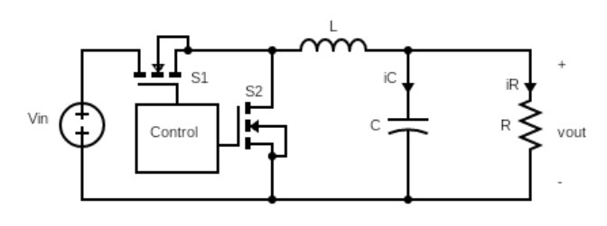

# MPPT仿真实验

## MPPT介绍

MPPT(Maximum Power Point Tracking, MPPT)是针对于光伏电池的输出特性具有非线性，会受到外界环境的影响。在工作环境一定的条件下，其功率值与电压值具有对应关系，仅在一个特殊的电压值下，会存在一个全局的最大功率值，若光伏电池工作在此电压下，系统的输出便会在最大功率点（Maximum Power Point, MPP）处，光伏系统的效率是最高。

最常见的扰动观察法 Perturb and observe(P&O)：首先测量光伏电池两端的电压，在对前一时刻的功率与本次的功率进行对比后，给予新的扰动变化量，最后通过这样的反复对比来判断是否位于最大功率点。

给电池充电，尽量保证恒流恒压d Constant Current-
Constant Voltage (CC- CV) 。利用matlab实现MPPT-CC-CV算法的仿真。

## 需求

将太阳能板的输出电压通过Buck电路降压到12V给锂电池充电。

太阳能板参数：

* 太阳能板数量：1块
* 开路电压：22.5V
* 短路电流：1.98；
* 最大功率点电压：18V
* 最大功率点电流：1.12V

锂电池参数：

* 标称电压：12V
* 标称容量：5Ah
* 初始容量：45%

## 仿真

仿真电路采用同步Buck电路实现降压：

传统的二极管换成Mosfet，减少能量的损失

