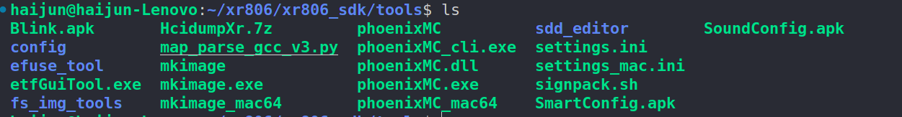

# XR806-串口测试

[toc]

XR806芯片，它是一款基于安谋科技的STAR-MC1处理器来研发设计的支持WiFi和BLE的高集成度无线MCU芯片，本次开发板来自于极术社区的试用活动:[全志XR806开发板免费试用，支持开源鸿蒙系统+FreeRTOS](https://aijishu.com/e/1120000000426896)。本次有幸再次参加，打算试基于该开发板实现[micro-ROS](https://micro.ros.org/)移植。micro-ROS旨在将ROS2部署在微控制器中。micro-ROS和其他ROS2节点的常用通信方式为uart和udp，因此要是移植，首先需要打通XR806的uart和udp的功能。本篇文章主要实现XR806的串口测试。

## XR806


XR806XR806开源鸿蒙开发板是一款基于XR806芯片设计，高度集成WiFi/BLE/常用外设，可供开发者进行方案评估、DIY或小规模产品研发，可广泛应用于智能家居、智能楼宇、智能城市和工业互联等领域。具体介绍详见[链接](https://xr806.docs.aw-ol.com/xr806_dev/)

**本次试基于它推出的基于FreeRTOS的SDK。**

## 环境搭建

开发环境为Ubuntu20.4

### 资源获取

**获取SDK**

```shell
mkdir xr806_sdk 
cd xr806_sdk
git clone https://sdk.aw-ol.com/git_repo/XR806/xr806_sdk/xr806_sdk.git
```

以上链接不容易拉取成功，可以参考该篇文章：[【XR806开发板试用】全志XR806开发板FreeRTOS代码包及开发环境搭建教程](https://aijishu.com/a/1060000000426976)获取。

**获取交叉编译链**

交叉工具链使用[gcc-arm-none-eabi-8-2019-q3-update](https://developer.arm.com/tools-and-software/open-source-software/developer-tools/gnu-toolchain/gnu-rm/downloads/8-2019q3-update)。

```shell
# 切换到Toolchain 压缩包所在目录，例如为~/tools 目录
cd ~/xr806/tools
tar -jxf gcc-arm-none-eabi-8-2019-q3-update-linux.tar.bz2
```

### SDK简介

SDK文件目录如下：

```shell
.
├── bin # bin 文件目录，存放预置bin 文件
├── chip.mk
├── config.mk
├── gcc.mk
├── Kconfig
├── Makefile
├── include # 头文件目录，存放模块对外头文件
├── lib # 库文件目录，存放预置库文件和编译生成的库文件
│ ├── libaac.a
│ ├── libadt.a
│ └── ......
├── out # 编译生成文件存放目录，存放编译生成的bin 和image
├── project # 工程总目录
│ ├── bootloader # bootloader 工程
│ ├── common # 工程公用代码
│ ├── demo # 演示工程总目录，该目录下每个目录对应一个工程
│ │ ├── hello_demo
│ │ ├── wlan_demo
│ │ └── ......
│ ├── example # 示例工程总目录，该目录下每个目录对应一个工程
│ │ ├── uart
│ │ ├── wlan
│ │ └── ......
│ ├── image_cfg
│ │ └── image.cfg # 默认镜像配置文件
│ ├── linker_script
│ │ └── gcc
│ │ ├── appos.ld # 工程默认链接脚本
│ │ └── bootloader.ld # bootloader 链接脚本
│ ├── project.mk
│ ├── Kconfig
│ └── ......
├── src
│ ├── driver
│ │ ├── chip # 芯片外设驱动
│ │ └── component # 扩展外设驱动
│ ├── image # image 模块
│ ├── kernel # 内核
│ ├── ota # OTA 模块
│ └── ......
├── ......
└── tools # 镜像打包及烧录等工具

```

SDK的代码编译和镜像创建采用Makefile进行管理，关键Makefile和配置文件的说明见表

| 文件路径                         | 功能描述及相关说明                                           |
| -------------------------------- | ------------------------------------------------------------ |
| gcc.mk                           | 1. 定义通用编译规则，例如交叉编译工具链、编译选项、链接选项等 2. 用户只需要修改交叉编译工具链的路径定义“CC_DIR” |
| config.mk                        | 1. 定义全局配置选项。所有全局配置选项均有默认值，其作用范围是SDK所有代码 2. 一般情况下，用户不需要修改此文件。如果用户需要改变全局配置选项的值，可在“project/[prj]/gcc/localconfig.mk”中进行重定义，从而覆盖默认值 |
| chip.mk                          | 定义芯片配置选项，不允许用户修改                             |
| src/Makefile                     | 定义SDK模块，每个模块编译后均生成对应的库文件                |
| src/lib.mk                       | 定义模块通用编译规则                                         |
| src/[module]/Makefile            | 模块编译的Makefile，用于指定模块的库文件名、源文件等         |
| project/project.mk               | 定义工程的通用编译规则，一般无需修改                         |
| project/[prj]/gcc/localconfig.mk | 定义特定工程的本地配置选项。在此文件中定义的配置选项将会覆盖“config.mk”中定义的默认值 |
| project/[prj]/gcc/Makefile       | 特定工程的Makefile，用于指定工程板级配置、源文件、链接脚本、镜像配置文件等 |
| project/common/prj_conf_opt.h    | 1. 定义工程功能选项的默认配置（即针对所有工程的默认配置）。每个功能选项对应一个宏定义，例如中断服务程序栈大小（PRJCONF_MSP_STACK_SIZE）、主线程栈大小（PRJCONF_MAIN_THREAD_STACK_SIZE）等 2. 该文件中定义的宏，“project/”目录下的所有源文件均可见 3. 一般情况下，用户不需要修改此文件。如果特定工程需要改变某功能选项的值，可在“project/[prj]/prj_config.h”中进行重定义，从而覆盖默认值 |
| project/[prj]/prj_config.h       | 1. 定义特定工程的功能选项配置值。在此文件中定义的功能选项值将会覆盖“project/common/prj_conf_opt.h”中定义的默认值 2. 每个工程都必须实现本工程的“prj_config.h”文件 3. 该文件中定义的宏，“project/”目录下的所有源文件均可见 |

需要我们关注的配置的文件如下：(以`project/demo/hello_demo`为主)

1. `project/demo/hello_demo/gcc/Makefile`: 用于指定工程的板级配置、源文件、链接脚本、额外的头文件和静态文件。
2. `project/demo/hello_demo/gcc/defconfig`：配置一些组件是否开启。
3. `gcc.mk`:配置交叉编译链的路径

**代码编译和镜像创建命令的说明见表**

| 命令                   | 行为                                                         |
| ---------------------- | ------------------------------------------------------------ |
| make config            | 配置工程平台芯片型号及板级晶振选型，目前主要包括XR872和XR808平台，配置完成后将在xradio-skylark-sdk目录下生成.config文件 *注:在编译之前必须执行，否则无法编译* |
| make config_clean      | 清除.config文件                                              |
| make lib               | 编译功能模块，生成.a文件并拷贝到lib目录下                    |
| make lib_clean         | 清理已编译的lib目标文件，及模块的.o文件，但并不会删除lib下的.a文件 |
| make lib_install_clean | 清理lib下的.a文件                                            |
| make                   | 编译工程代码，生成可执行文件（位于“project/[prj]/gcc/”目录） |
| make clean             | 清除make命令生成的目标文件                                   |
| make image             | 创建镜像文件（位于“project/image/xxx/”目录）                 |
| make build             | 等同于make lib && make && make image                         |
| make build_clean       | 等同于make image_clean clean lib_clean lib_install_clean     |
| make objdump           | 生成反汇编文件，用于代码分析和调试                           |
| make size              | 显示工程ELF文件的size信息，如text段、data段、bss段大小等     |

## uart实现

uart有三种工作模式：

* 阻塞
* 中断
* DMA

本次使用DMA方式

### 1. 创建工程

以`hello_demo`作为模板

```shell
#cd 到XR806_sdk目录下
cd ~/xr806/xr806_sdk
# 复制工程
cp -r project/demo/hello_demo/ project/demo/ros2/

```

 修改工程defconfig，文件位于`roject/demo/ros2/gcc/defconfig`。修改如下：

```
CONFIG_PROJECT="demo/ros2"
CONFIG_XIP=y
CONFIG_OTA=y
CONFIG_WLAN=y
```

定义工程名字，开启XIP、OTA和WLAN

`main.c`

```c
#include "common/framework/platform_init.h"
#include <stdio.h>
#include "kernel/os/os.h"

#include "driver/chip/hal_gpio.h"
#include "driver/chip/hal_uart.h"

#define LED_PORT            GPIO_PORT_A
#define LED_PIN             GPIO_PIN_21

#define UARTID 				UART1_ID
HAL_Status status = HAL_ERROR;

/*LED 初始化*/
static void led_init(void)
{
	GPIO_InitParam param;
	param.driving = GPIO_DRIVING_LEVEL_1;
	param.mode = GPIOx_Pn_F1_OUTPUT;
	param.pull = GPIO_PULL_NONE;
	HAL_GPIO_Init(LED_PORT, LED_PIN, &param);
}

/*串口1初始化*/
static int uart_init(void)
{
	UART_InitParam param;

	param.baudRate = 115200;
	param.dataBits = UART_DATA_BITS_8;
	param.stopBits = UART_STOP_BITS_1;
	param.parity = UART_PARITY_NONE;
	param.isAutoHwFlowCtrl = 0;

	if(HAL_UART_Init(UARTID, &param) != HAL_OK)
		return -1;
	/*使能DMA*/
	if (HAL_UART_EnableTxDMA(UARTID) != HAL_OK)
		return -2;
	if (HAL_UART_EnableRxDMA(UARTID) != HAL_OK)
		return -3;
	
	return 0;
}

int main(void)
{
	uint8_t led_flag = 0;
	platform_init();
	led_init();
	status = uart_init();
	if (status != HAL_OK){
		printf("uart init fail! %d\n", status);
		return -1;
	}
	/*测试uart*/
	char buffer[20];
	uint8_t rx_data;
	int32_t len = 0;
	/*发送*/
	len = snprintf(buffer, 20, "uart%d DMA mode.\n", UARTID);
	len = HAL_UART_Transmit_DMA(UARTID, (uint8_t *)buffer, len);
	if(len < 0){
		printf("send data fail by uart!\n");
	}
	
	while (1) {
		led_flag++;
		HAL_GPIO_WritePin(LED_PORT, LED_PIN, led_flag % 2);
		/*接收*/
		len = 0;
		len = HAL_UART_Receive_DMA(UARTID, &rx_data, 1, 1000); 
		if(len > 0){
			printf("%c", rx_data);
			/*回显*/
			HAL_UART_Transmit_DMA(UARTID, &rx_data, 1);
		} 
		// OS_MSleep(500);
	}
	return 0;
}

```

* ` led_init(void)`:初始化LED，程序循环时闪烁，指示程序正常运行；
* `uart_init()`：初始化uart，串口波特率为115200，数据位8位，停止位1位。在发送和接收时启用DWA。
* `main()`:通过uart实现回显效果，以测试uart的发送和接收功能是否正常。

### 2. 编译和烧录

**添加交叉编译链**

在文件`gcc.mk`中添加：

```shell
CC_DIR := ~/xr806/tools/gcc-arm-none-eabi-8-2019-q3-update/bin
```

复制配置文件到顶层

```shell
cp project/demo/ros2/gcc/defconfig .config
```

```shell
#检查SDK的配置是否正常
 make menuconfig
 # 清理，切换工程时需要
 make build_clean
 # 编译成镜像文件
 make build -j6
```


最后生成的镜像文件为：microros_system.img

**下载**

SDK提供的下载工具位于工程文件的`tools`中。



其中，`phoeniXMC`为linux在的下载工具，其提供的命令如下：

```she
haijun@haijun-Lenovo:~/xr806/xr806_sdk/tools$ ./phoenixMC -h

Version: v1.2.00815b(by notebook)
phoenixMC_u -A [debug flash address]  (default: 0x00000000)
phoenixMC_u -b [baud rate]  (default: 921600)
phoenixMC_u -B [flash debug bin file for write]  (default: a.bin)
phoenixMC_u -c [com dev] (default: /dev/ttyUSB0)
phoenixMC_u -C [config file] (default: ./settings.ini)
phoenixMC_u -d [debug log level]  (default: 0)
phoenixMC_u -D [debug flash mode]  (default: n=NULL)
phoenixMC_u -e [enable etf image]  (default: 0)
phoenixMC_u -f [enable flash compat]  (default: 1)
phoenixMC_u -g [enable combine images]
phoenixMC_u -G [combine image path]  (default: combine_image.cimg)
phoenixMC_u -h [help msg]
phoenixMC_u -i [wlan image path]  (default: xr-system.img)
phoenixMC_u -I [ETF image path]  (default: xr-system_etf.img)
phoenixMC_u -l [log file path]   (default: ./log/log.txt)
phoenixMC_u -L [debug flash length]   (default: 0x00000200)
phoenixMC_u -r [read and check after write]  (default: 0)
phoenixMC_u -s [show image info]
phoenixMC_u -u [update changed blocks only]  (default: 1)
phoenixMC_u -v [show version]

When it's upgrading, input 'stop' to stop it if you need.
```

**下载命令**

```shell
cd tools
./phoenixMC -i ../out/microros_system.img 
```

```she
haijun@haijun-Lenovo:~/xr806/xr806_sdk/tools$ ./phoenixMC -i ../out/microros_system.img 
--------------SETTING--------------
COM:/dev/ttyUSB0
Baud:921600
Log path:./log/log.txt
Log level:0
Image path:../out/microros_system.img
ETF image path:xr_system_etf.img
Read and check:NO
Update change only:YES
Program ETF image:NO
Use flash compat:YES

*************************************************
               firmware information              
*************************************************
*******************************************************************************************************************
bin version: 5
bin count: 6
No.     ID               sram_offs       data_size       next_section    attribute       private
 1      0xA5FF5A00       0x00230000      0x000029C8      0x00004000      0x00000001      0xFFFFFFFFFFFFFFFFFC03FFFF
 2      0xA5FE5A01       0x00201000      0x00006C78      0x00029800      0x00000001      0xFFFFFFFFFFFFFFFFFFFFFFFF
 3      0xA5FD5A02       0xFFFFFFFF      0x00069160      0x000F1800      0x00000002      0xFFFFFFFFFFFFFFFFFFFFFFFF
 4      0xA5FA5A05       0xFFFFFFFF      0x00000910      0x000F2800      0x00000001      0xFFFFFFFFFFFFFFFFFFFFFFFF
 5      0xA5F95A06       0xFFFFFFFF      0x00007F84      0x000FA800      0x00000001      0xFFFFFFFFFFFFFFFFFFFFFFFF
 6      0xA5F85A07       0xFFFFFFFF      0x00000320      0xFFFFFFFF      0x00000001      0xFFFFFFFFFFFFFFFFFFFFFFFF
*******************************************************************************************************************

not Combined image!!
3%: Opening com...
10%: Checking the 1 block,total 15 block(s)...
...
...
74%: Checking the 13 block,total 15 block(s)...
79%: Checking the 14 block,total 15 block(s)...
84%: Checking the 15 block,total 15 block(s)...
90%: Checking rest data of 64k...
100%: Upgrade OK!
```

## 效果

<video src="../../picture/XR806-串口测试/xr806串口测试.mp4"></video>

## 总结

* uart 应为有demo，所以实现得比较顺利；
* 想通过FreeRTOS建立多线程失败，目前只能在main线程中进行操作。关于线程的建立，还有待研究；

## 下一步计划

1. 移植micro-ROS，实现在uart下的通信；
2. 完成udp测试；
3. 实现micro-ROS在udp下的通信；
