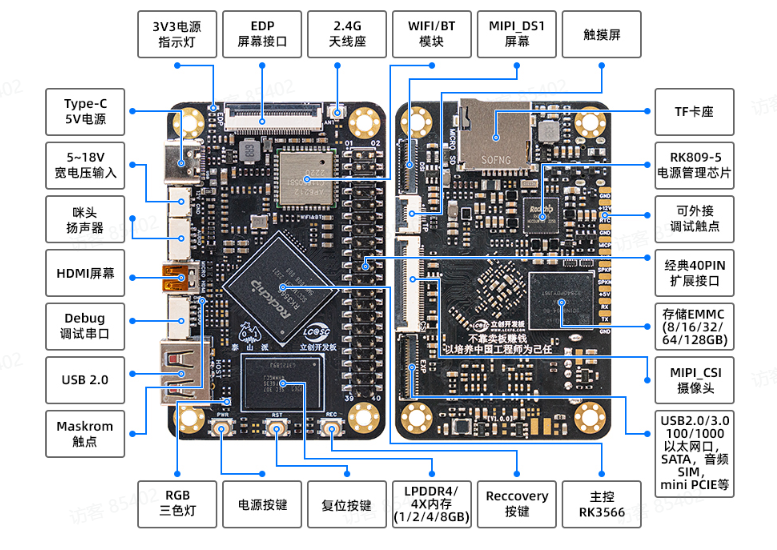

# 泰山派-笔记

开发板资源

RK3566

参数：

* 主控：四核Cotex-A55；
* 频率：1.8GHz；
* 内存：2G；
* 存储：16G

## 镜像烧录

驱动：DriverAssitant_v5.1.1

烧录工具：RKDevTool_Release_v2.92

* loader升级模式：

先按住REC按钮不放，接着按下复位按键并松开，当烧录软件中出现“发现一个LOADER设备”后松开REC按钮

* maskrom升级模式：

用来救砖的；

先断开typec给开发板断电，泰山派开发板MicroHDMI附件有两个触点，使用镊子短接这两个触点，然后进行上电操作，当烧录软件中出现“发现一个MASKROM设备”后松开镊子。