# ESP32 - mpu6050

[toc]

## 硬件

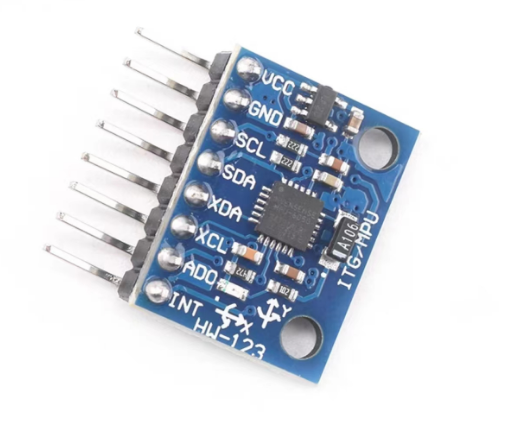

引脚说明

| 引脚 | 说明                                                         |
| ---- | ------------------------------------------------------------ |
| VCC  | 电源端，mpu6050自带稳压芯片，因此接受5V和3.3V供电            |
| GND  | 电源地                                                       |
| SCL  | I2C时钟线                                                    |
| SDA  | I2C数据线                                                    |
| XDA  | 外接设备的数据线                                             |
| XCL  | 外接设备的时钟线                                             |
| ADO  | mpu6050设备地址控制，ADO=1，地址为0x69， ADO=0或者悬空，地址为0x68 |
| INT  | 中断引脚：一旦mpu6050有数据输出时，该引脚有相应的电平信号，可以用于保持MPU信号的实时性 |

和ESP32的连接

| MPU6050 | ESP32 |
| ------- | ----- |
| VCC     | 3.3V  |
| GND     | GND   |
| SCL     | 2     |
| SDA     | 18    |
| XDA     | 未接  |
| XCL     | 未接  |
| ADO     | 悬空  |
| INT     | 未接  |

## I2C

I2C数据帧

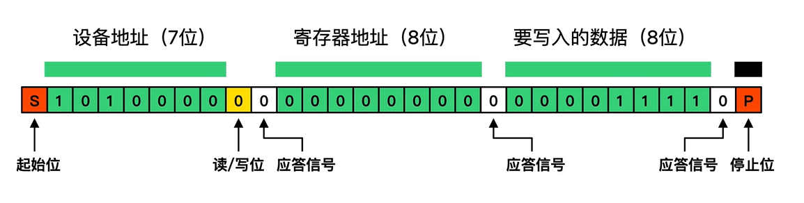

* 起始位：SCL高电平，SDA下降沿；
* 设备地址：7位；
* 读写位：0：主设备向从设备写数据，1：主设备向从设备读数据；
* 应答信号：从设备应答，从设备正常应答时，SDA为低电平，从设备忙，SDA为高电平；
* 寄存器地址：8位；
* 应答信号：
* 数据：写入寄存器数据（8位）；
* 停止位：SCL高电平，SDA上升沿；

ESP-idf提供I2C驱动程序，因此I2C的配置比较简单。

步骤：

1. 配置驱动程序：设置初始化参数（如主机模式或从机模式，SDA 和 SCL 使用的 GPIO 管脚，时钟速度等），使用结构体`i2c_config_t conf`
2. 安装驱动程序：激活一个 I2C 控制器的驱动，该控制器可为主机也可为从机；使用函数`i2c_driver_install()`

```c
#define I2C_MASTER_SCL_IO           8       // 时钟线
#define I2C_MASTER_SDA_IO           18      // 数据线
#define I2C_MASTER_NUM              0       // I2C master i2c port number
#define I2C_MASTER_FREQ_HZ          400000  // I2C频率                 
#define I2C_MASTER_TX_BUF_DISABLE   0       /*!< I2C master doesn't need buffer */
#define I2C_MASTER_RX_BUF_DISABLE   0       /*!< I2C master doesn't need buffer */

esp_err_t i2c_master_init(void)
{
    int i2c_master_port = I2C_MASTER_NUM;
    i2c_config_t conf = {
        .mode = I2C_MODE_MASTER,
        .sda_io_num = I2C_MASTER_SDA_IO,
        .scl_io_num = I2C_MASTER_SCL_IO,
        .sda_pullup_en = GPIO_PULLUP_ENABLE,
        .scl_pullup_en = GPIO_PULLUP_ENABLE,
        .master.clk_speed = I2C_MASTER_FREQ_HZ,
    };

    i2c_param_config(i2c_master_port, &conf);

    return i2c_driver_install(i2c_master_port, conf.mode, I2C_MASTER_RX_BUF_DISABLE, I2C_MASTER_TX_BUF_DISABLE, 0);
}
```

## MPU6050的相关名词

* 陀螺仪：测量的是绕xyz轴转动的角速度，单位：Degree Per Second的缩写°/S ；
* 加速度：测量的是xyz方向受到的加速度，静止状态下，三个方向的合加速度为重力加速度；

* DMP：Digital Motion Processor，直接输出四元数，并非完全开源；
* 四元数：四元数可以方便的表示3维空间的旋转。基本形式：$q_0+q_1*i+q_2*j+q_3*k$，一个实部和三个虚部；
* 欧拉角：pitch：俯仰（绕y轴旋转）、roll滚动（绕X轴旋转）：、yaw：偏航（绕Z轴旋转）的表示形式，方便观察姿态。不过存在死锁现象；

## MPU6050 配置

MPU6050配置主要根据数据手册配置相关寄存器来。

```c
#define MPU_DEVICE_ID_REG		0X75	//器件ID寄存器
#define MPU_PWR_MGMT1_REG		0X6B	//电源管理寄存器1
#define MPU_CFG_REG				0X1A	//配置寄存器
#define MPU_SAMPLE_RATE_REG		0X19	//采样频率分频器
#define MPU_GYRO_CFG_REG		0X1B	//陀螺仪配置寄存器
#define MPU_ACCEL_CFG_REG		0X1C	//加速度计配置寄存器

	/*读取设备ID，判断I2C通信是否正常*/
    ESP_ERROR_CHECK(mpu6050_register_read(MPU_DEVICE_ID_REG, data, 1));
    ESP_LOGI(TAG, "WHO_AM_I = %X", data[0]);
    /*重置设备*/
    ESP_ERROR_CHECK(mpu6050_register_write_byte(MPU_PWR_MGMT1_REG, 0x80));
    vTaskDelay(100 / portTICK_PERIOD_MS);
    /*禁用睡眠模式，选择X轴陀螺仪为时钟源*/
     ESP_ERROR_CHECK(mpu6050_register_write_byte(MPU_PWR_MGMT1_REG, 0x01));
    /*配置数字低通滤波器，带宽为5，陀螺仪输出频率为1kHz*/
    ESP_ERROR_CHECK(mpu6050_register_write_byte(MPU_CFG_REG, 0x06));
    /*配置采样频率:50Hz*/
    ESP_ERROR_CHECK(mpu6050_register_write_byte(MPU_SAMPLE_RATE_REG, 19));
    /*配置陀螺仪量程:± 2000 °/s, 不自检*/
    ESP_ERROR_CHECK(mpu6050_register_write_byte(MPU_GYRO_CFG_REG, 0x18));
    /*配置加速度计量程: ± 16g， 不自检*/
    ESP_ERROR_CHECK(mpu6050_register_write_byte(MPU_ACCEL_CFG_REG, 0x18));
```

### 1 WHO_AM_I

读取mpu6050的ID；默认为0x68，可以用来验证IIC底层是否配置好。其最后一位由ADO决定。如果ADO=1，寄存器的的值为0x69，否则为0x68；

```c
ESP_ERROR_CHECK(mpu6050_register_read(MPU_DEVICE_ID_REG, data, 1));
```


### 2 Power Management 1

配置电源和时钟源，用于重置设备和禁用温度传感器；

```c
/*重置设备*/
ESP_ERROR_CHECK(mpu6050_register_write_byte(MPU_PWR_MGMT1_REG, 0x80));
vTaskDelay(100 / portTICK_PERIOD_MS);
/*禁用睡眠模式，选择X轴陀螺仪为时钟源*/
ESP_ERROR_CHECK(mpu6050_register_write_byte(MPU_PWR_MGMT1_REG, 0x01));
```


* 参数：

| 参数         | 描述                                                         |
| ------------ | ------------------------------------------------------------ |
| DEVICE_RESET | 为1：所有寄存器重置为默认值                                  |
| SLEEP        | 为1：进入休眠模式                                            |
| CYCLE        | `SLEEP=0 && CYCLE = 1 `MPU在休眠和唤醒中循环，循环周期由LP_WAKE_CTRL（寄存器108）来确定 |
| TEMP_DIS     | 为1：禁用温度传感器                                          |
| CLKSEL       | 指定时钟源                                                   |

| CLKSEL | 描述                              |
| ------ | --------------------------------- |
| 0      | 使用内部时钟源：8MHz              |
| 1      | X轴陀螺仪作为参考（**一般选择**） |
| 2      | y轴陀螺仪作为参考                 |
| 3      | Z轴陀螺仪作为参考                 |
| 4      | 使用外部时钟源：32.768MHz         |
| 5      | 使用外部时钟源：19.2MHz           |
| 6      | 保留                              |
| 7      | 停用时钟源，定时器复位            |

一般配置:

1. 重置寄存器，Bit7 = 1，所以，`Power_Management_1 = 0x80`；
2. 解除休眠，时钟源设置为X轴，Bit0=1：`Power_Management_1 = 0x01`；

**注意：重置寄存器后SLEEP自动为1， 所以必须解除休眠，否则没有数据输出**

### 3 Configuration

```c
/*配置数字低通滤波器，带宽为5，陀螺仪输出频率为1kHz*/
 ESP_ERROR_CHECK(mpu6050_register_write_byte(MPU_CFG_REG, 0x06));
```

主要用于配置数字低通滤波器（DLPF_CFG）,确定陀螺仪的输出频率。

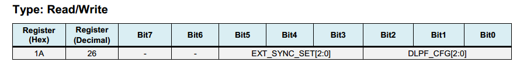

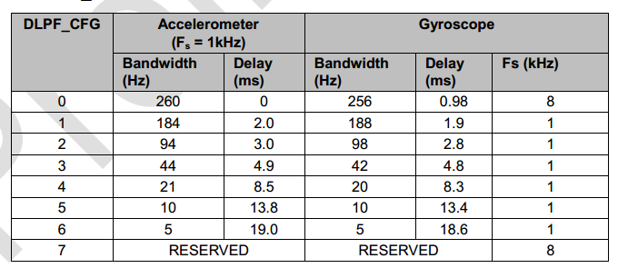

如果启用数字低通滤波器（`DLPF_CFG != 0 orDLPF_CFG != 7 `），则陀螺仪的采样频率只能为1KHz，

配置：

* Bit2 =1 and Bit1 = 1，所以，`Configuration = 0x06`

### 4 SMPRT_DIV

```c
/*配置采样频率:50Hz*/
ESP_ERROR_CHECK(mpu6050_register_write_byte(MPU_SAMPLE_RATE_REG, 19));
```

设置传感器的采样速率


$$
采样率 = \frac{陀螺仪输出频率}{(1 + SMPLRT\_DIV)}
$$
陀螺仪的输出频率由DLPF_CFG （寄存器26）进行配置，目前陀螺仪输出频率配置为1KHz。

配置：

* 采样速率配置为50Hz，由$50 = \frac{1000}{(1 + SMPLRT\_DIV)}$知，`SMPRT_DIV = 19`

### 5 Gyroscope Configuration

是否启用自检和设置陀螺仪量程

```c
 /*配置陀螺仪量程:± 2000 °/s, 不自检*/
 ESP_ERROR_CHECK(mpu6050_register_write_byte(MPU_GYRO_CFG_REG, 0x18));
```

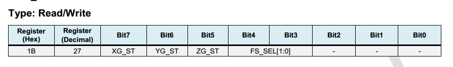：

| 参数   | 描述                   |
| ------ | ---------------------- |
| XG_ST  | 为1，启动X轴陀螺仪自检 |
| YG_ST  | 为1，启动y轴陀螺仪自检 |
| ZG_ST  | 为1，启动Z轴陀螺仪自检 |
| FS_SEL | 设置陀螺仪量程         |

*自检：简单理解为重新设置零位（有可能理解不对）。*

量程设置

| FS_SEL | 满量程     | LSB灵敏度    |
| ------ | ---------- | ------------ |
| 0      | ± 250 °/s  | 131 LSB/°/s  |
| 1      | ± 500 °/s  | 65.5 LSB/°/s |
| 2      | ± 1000 °/s | 32.8 LSB/°/s |
| 3      | ± 2000 °/s | 16.4 LSB/°/s |

设置：

* 一般设置为不自检，最大满量程：Bit4 = 1 & Bit3 = 1, 所以`Gyroscope Configuration = 0x18`

### 6 Accelerometer Configuration

```c
 /*配置加速度计量程: ± 16g， 不自检*/
 ESP_ERROR_CHECK(mpu6050_register_write_byte(MPU_ACCEL_CFG_REG, 0x18));
```

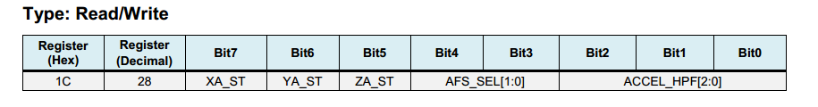

* 描述：配置加速度是否自检和量程范围

| 参数    | 描述                   |
| ------- | ---------------------- |
| XA_ST   | 为1，启动X轴加速度自检 |
| YA_ST   | 为1，启动y轴加速度自检 |
| ZA_ST   | 为1，启动Z轴加速度自检 |
| AFS_SEL | 设置加速度量程         |

量程设置

| AFS_SEL | 满量程 | LSB灵敏度    |
| ------- | ------ | ------------ |
| 0       | ± 2g   | 16384 LSB/mg |
| 1       | ± 4g   | 8192 LSB/mg  |
| 2       | ± 8g   | 4096 LSB/mg  |
| 3       | ± 16g  | 2048 LSB/mg  |

设置：

* 一般设置为不自检，最大满量程：Bit4 = 1 & Bit3 = 1, 所以`Gyroscope Configuration = 0x18`

## 读取原始数据

以下代码读取温度，陀螺仪，加速度计的原始数据

```c
/**
* @brief 读取温度值
*/
esp_err_t mpu6050_get_temperature(float *temp)
{
    int ret;
    uint8_t data[2];
    int16_t raw;
    ret = mpu6050_register_read(MPU_TEMP_OUTH_REG, data, 2);
    raw = (int16_t)((data[0] << 8) + data[1]);
    *temp = 36.53 + raw/340.0;
    return ret;
}
/**
 * @brief 读取陀螺仪值
*/
esp_err_t mpu6050_get_gyroscope(float *gxyz)
{
    int ret;
    uint8_t data[6];
    int16_t raw_gxyz[3];
    float LSB[4] = {131.0, 65.5, 32.8, 16.4};
    /*读取原始数据*/
    ret = mpu6050_register_read(MPU_GYRO_XOUTH_REG, data, 6);
    if (ret == ESP_OK)
    {
        /*转化原始数据*/
        raw_gxyz[0] = (int16_t)((data[0] << 8) + data[1]);
        raw_gxyz[1] = (int16_t)((data[2] << 8) + data[3]);
        raw_gxyz[2] = (int16_t)((data[4] << 8) + data[5]);
    }
    /*读取量程*/
    ret = mpu6050_register_read(MPU_GYRO_CFG_REG, data, 1);
        
    if (ret == ESP_OK)
    {
        uint8_t a = (data[0] & 0X18) >> 3;
        printf("ga = %d\n", a);
        // 实际值
        for (uint8_t i = 0; i < 3; i++)
        {
            gxyz[i] =raw_gxyz[i] / LSB[a];
        }
    }
    
    return ret; 
}
/**
 * @brief 读取加速度值
*/
esp_err_t mpu6050_get_accelerometer(float *axyz)
{
    int ret;
    uint8_t data[6];
    int16_t raw_axyz[3];
    float LSB[4] = {16384.0, 8192.0, 4096.0, 2048.0};
    /*原始值*/
    ret = mpu6050_register_read(MPU_ACCEL_XOUTH_REG, data, 6);
    if (ret == ESP_OK)
    {
        raw_axyz[0] = (int16_t)((data[0] << 8) + data[1]);
        raw_axyz[1] = (int16_t)((data[2] << 8) + data[3]);
        raw_axyz[2] = (int16_t)((data[4] << 8) + data[5]);
    }
    /*读取量程*/
    ret = mpu6050_register_read(MPU_ACCEL_CFG_REG, data, 1);
    if (ret == ESP_OK)
    {
        uint8_t a = (data[0] & 0X18) >> 3 ;
        printf("aa = %d\n", a);
        /*转化为实际值*/
        for (uint8_t i = 0; i < 3; i++)
        {
            axyz[i] =raw_axyz[i] / LSB[a];
        }
        
    }
    return ret; 
}
```

### 7 Temperature Measurement

读取温度的值

函数`esp_err_t mpu6050_get_temperature(float *temp)`

寄存器


每个数据由两个寄存器组成，数据更新速度由寄存器25的采样速度控制。

和实际温度的转化关系：` *temp = 36.53 + raw/340.0;`没有在手册中查到，抄别人的代码。

### 8 Gyroscope Measurements

读取陀螺仪的数据

```c
esp_err_t mpu6050_get_gyroscope(float *gxyz)
```

寄存器：

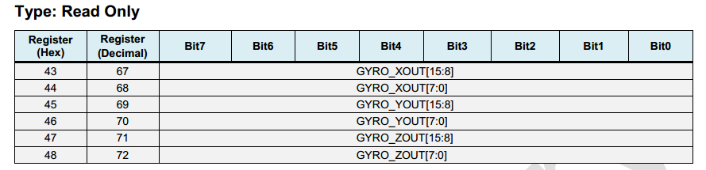

每个数据由两个寄存器组成，数据更新速度由寄存器25的采样速度控制

由于XYZ的数据连续，所以直接读了6个值，并根据LSB转化为实际值。

### 9 Accelerometer Measurements 

读取加速度的值

```c
esp_err_t mpu6050_get_accelerometer(float *axyz)
```

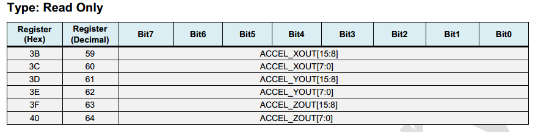

每个数据由两个寄存器组成，数据更新速度由寄存器25的采样速度控制。

由于XYZ的数据连续，所以直接读了6个值，并根据LSB转化为实际值。

## 其他自认为有用的寄存器

### 9  FIFO Enable

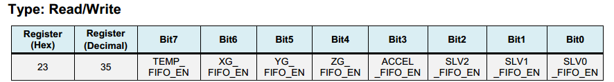

* 描述：决定那些寄存器的数据会被放入缓冲器中

| 参数                               | 描述               |
| ---------------------------------- | ------------------ |
| TEMP_FIFO_EN                       | 温度传感器         |
| XG_FIFO_EN、YG_FIFO_EN、ZG_FIFO_EN | 陀螺仪输出的寄存器 |
| ACCEL_FIFO_EN                      | 加速度输出的寄存器 |
| ...                                | 后面三个未做了解   |

### 10  Interrupt Enable

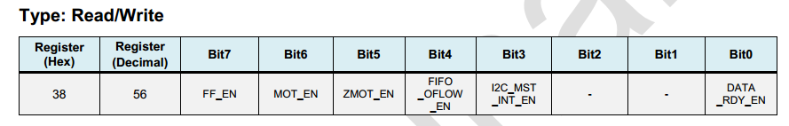

* 描述，是否是能相应中断

### 11 User Control

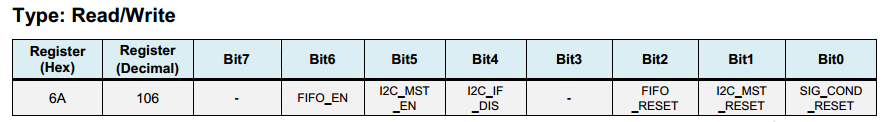

* 描述：配置是否启用FIFO，IIC的主从，重置FIFO和传感器

| 参数           | 描述                             |
| -------------- | -------------------------------- |
| FIFO_EN        | 使能FIFO                         |
| I2C_MST_EN     | 是能i2c为主模式                  |
| I2C_IF_DIS     | 禁用I2c，启用SPI                 |
| FIFO_RESET     | 重置FIFO                         |
| I2C_MST_RESET  | 重置I2C主模式，重置以后自动变为0 |
| SIG_COND_RESET | 重置所有传感器                   |

## 读取结果

将MPU6050静止平放在桌面上，获取连续3秒的数据

```c
  while (1)
    {
        ESP_ERROR_CHECK(mpu6050_get_temperature(&temp));
        ESP_LOGI(TAG, "temp = %.2f", temp);
        ESP_ERROR_CHECK(mpu6050_get_gyroscope(gxyz));
        ESP_LOGI(TAG, "gx = %.2f\t gy = %.2f\t gz = %.2f", gxyz[0], gxyz[1], gxyz[2]);
        ESP_ERROR_CHECK(mpu6050_get_accelerometer(axyz));
         ESP_LOGI(TAG, "ax = %.2f\t ay = %.2f\t az = %.2f", axyz[0], axyz[1], axyz[2]);
        vTaskDelay(1000 / portTICK_PERIOD_MS);
    }
```

读取周期为1S

```bash
I (6415) mpu6050-example: temp = 25.52
I (6415) mpu6050-example: gx = -4.21     gy = -0.49      gz = -1.59
I (6415) mpu6050-example: ax = 0.11      ay = 0.03       az = 1.03
I (7415) mpu6050-example: temp = 25.55
I (7415) mpu6050-example: gx = -4.21     gy = -0.49      gz = -1.59
I (7415) mpu6050-example: ax = 0.11      ay = 0.03       az = 1.04
I (8415) mpu6050-example: temp = 25.55
I (8415) mpu6050-example: gx = -4.21     gy = -0.49      gz = -1.59
I (8415) mpu6050-example: ax = 0.11      ay = 0.03       az = 1.04
```

定性分析：

* 温度：芯片摸着不发烫，25度左右算正常；
* 陀螺仪：理论上禁止，陀螺仪的数据应该为0，但是实际上存在一点数据，原因为止；
* 加速度计：静止时，加速度的合力应该为9.8，目前合力估计为10左右，说明读取的数据基本正常。

从定性分析的角度来说，根据datasheed配置应该没有错。

## 下一步计划

原始数据意义不大，纯粹用于学习。后面将进一步融合获取欧拉角。

* 使用MDP融合；
* 使用卡尔曼滤波融合；

