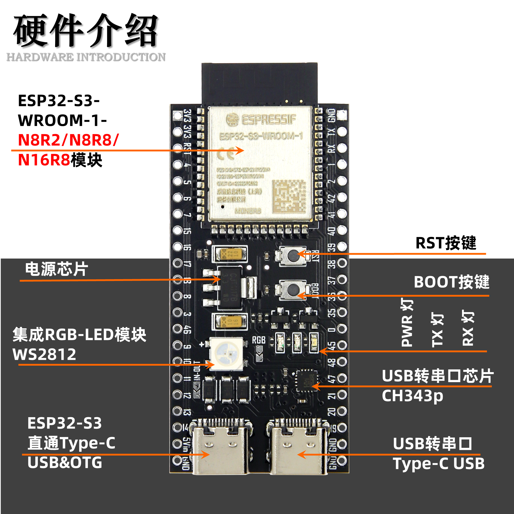
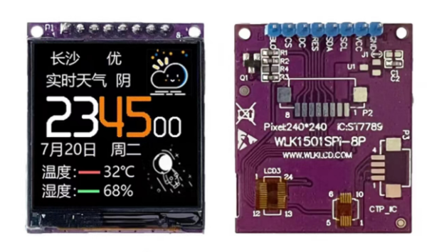
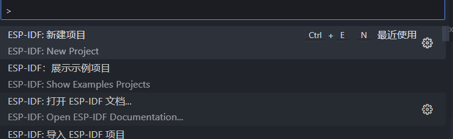
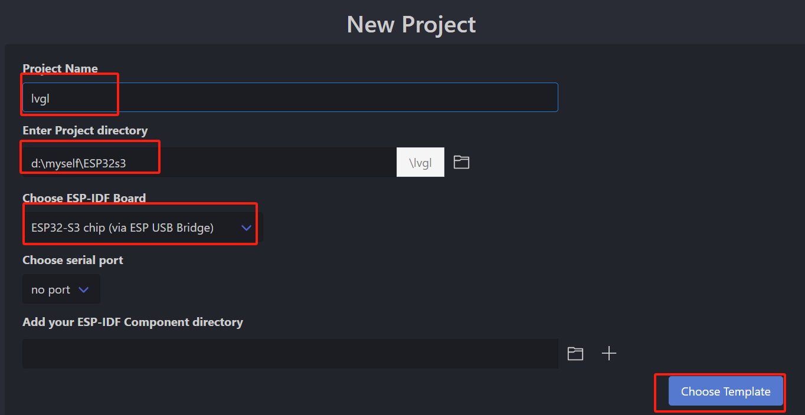
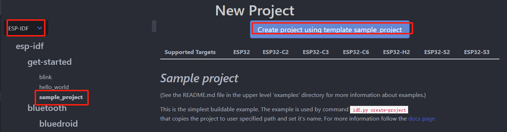
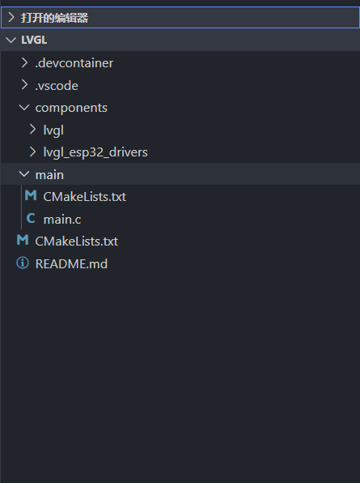
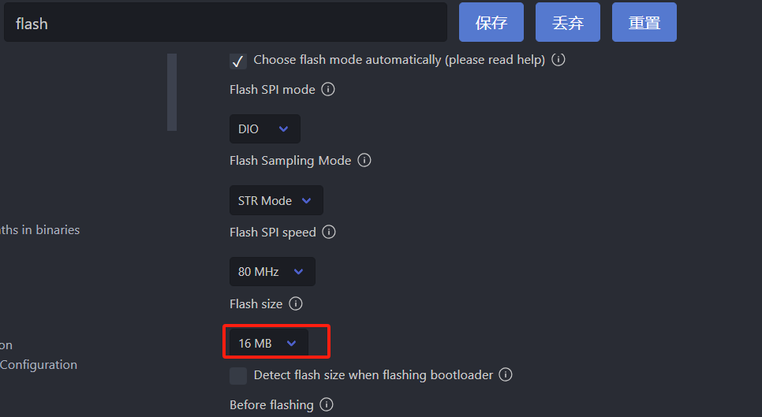
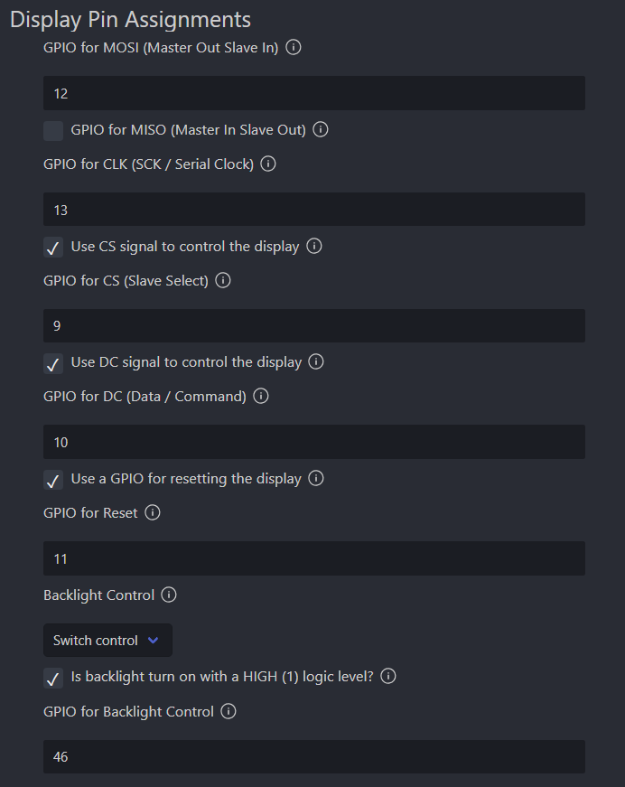
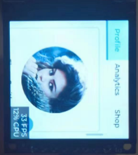

# ESP32S3（ESP-idf v5.1）移植lvgl（v8.3）

[toc]

## 前言

现在开始学习ESP32了，所以在网上买了块ESP32s3的开发板，点完灯以后的首要事则是两点亮屏幕，在点亮屏幕的过程中，发现lvgl仓库中提供的`lvgl_esp32_drivers`并不能顺利点亮屏幕，原因在于ESP-idf和lvgl更新的太快，导致有的函数不在适用，`lvgl_esp32_drivers`不适用。本文将使用最新的ESP-idf（v5.1）和lvgl（v8.3）点亮屏幕。

## 准备工作

### 硬件



没有使用官方的（有点小贵），顺便买个平替版。



屏幕使用一款TFT屏幕，分辨率为240*240，通信方式为SPI，驱动为ST7789。没有触摸芯片

### 环境

使用vscode插件：vscode-esp-idf-extension。其安装方法见官网；选择最新的稳定版本v5.1；

## 移植

### 1.新建工程

在vscode中打开命令面板，输入`ESP-IDF:New Project`



填写工程名字，选择路径，选择芯片，最后选择模板



本次选择ESP-idf



## 2.下载额外组件

ESP-idf中不包含lvgl，所以需要将lvgl和相应的驱动lvgl_esp32_drivers作为额外组件，放在工程中

1. 新建在工程中新建文件夹`components`,
2. 下载`lvg`和`lvgl_esp32_drivers`

```bash
git clone git@github.com:lvgl/lvgl_esp32_drivers.git
git clone -b release/v8.3 git@github.com:lvgl/lvgl.git
```

工程结构如下



### 3. 修改menuconfig

#### 修改flash



#### lvgl_esp32_drivers

* 驱动芯片：ST7789；
* 引脚配置；

| TFT  | ESP32 | 工程配置             |
| ---- | ----- | -------------------- |
| SCL  | 13    | CLK                  |
| SDA  | 12    | MISO                 |
| RES  | 11    | Rest                 |
| DC   | 10    | DC                   |
| CS   | 9     | CS                   |
| BLC  | 46    | 勾选高电平为点亮屏幕 |



### 4 编译

编译阶段主要根据错误提示修改

#### fatal error: driver/ledc.h: No such file or directory

```shell
D:/myself/ESP32s3/lvgl/components/lvgl_esp32_drivers/lvgl_tft/esp_lcd_backlight.c:10:10: fatal error: driver/ledc.h: No such file or directory
   10 | #include "driver/ledc.h"
      |          ^~~~~~~~~~~~~~~
compilation terminated.
```


* 原因：没有依赖driver组件
* 办法：在`components\lvgl_esp32_drivers\CMakeLists.txt`中增加driver的依赖

```cmake
idf_component_register(SRCS ${SOURCES}
                       INCLUDE_DIRS ${LVGL_INCLUDE_DIRS}
                       REQUIRES lvgl
                       REQUIRES driver)
```

#### implicit declaration of function 'gpio_pad_select_gpio' and 'portTICK_RATE_MS' undeclared

```shell
D:/myself/ESP32s3/lvgl/components/lvgl_esp32_drivers/lvgl_tft/st7789.c:89:5: error: implicit declaration of function 'gpio_pad_select_gpio'; did you mean 'esp_rom_gpio_pad_select_gpio'? [-Werror=implicit-function-declaration]
   89 |     gpio_pad_select_gpio(ST7789_DC);
      |     ^~~~~~~~~~~~~~~~~~~~
      |     esp_rom_gpio_pad_select_gpio
D:/myself/ESP32s3/lvgl/components/lvgl_esp32_drivers/lvgl_tft/st7789.c:100:22: error: 'portTICK_RATE_MS' undeclared (first use in this function); did you mean 'portTICK_PERIOD_MS'?
  100 |     vTaskDelay(100 / portTICK_RATE_MS);
      |                      ^~~~~~~~~~~~~~~~
      |                      portTICK_PERIOD_MS
```

* 原因：`gpio_pad_select_gpio()`和`portTICK_RATE_MS`发生变化；
* 办法：根据提示替换：`gpio_pad_select_gpio()`替换为`esp_rom_gpio_pad_select_gpio()`；`portTICK_RATE_MS`替换为`portTICK_PERIOD_MS`

#### error: 'LV_HOR_RES_MAX' undeclared

```shell
D:/myself/ESP32s3/lvgl/components/lvgl_esp32_drivers/lvgl_helpers.h:41:25: error: 'LV_HOR_RES_MAX' undeclared (first use in this function); did you mean 'LV_HOR_RES'?
   41 | #define DISP_BUF_SIZE  (LV_HOR_RES_MAX * 40)
```

* 原因：缺少宏定义
* 办法：添加

在`components\lvgl_esp32_drivers\lvgl_helpers.h`添加缺少的宏定义

```c
// 屏幕分辨率
#define LV_HOR_RES_MAX 240
#define LV_VER_RES_MAX 240
```

#### error: 'ledc_timer_config_t' has no member named 'bit_num'

```shell
D:/myself/ESP32s3/lvgl/components/lvgl_esp32_drivers/lvgl_tft/esp_lcd_backlight.c:52:14: error: 'ledc_timer_config_t' has no member named 'bit_num'
   52 |             .bit_num = LEDC_TIMER_10_BIT,
```

* 原因：结构体成员发生变化
* 办法：按照新的结构体删除`.bit_num`成员

```c
typedef struct {
    ledc_mode_t speed_mode;                /*!< LEDC speed speed_mode, high-speed mode or low-speed mode */
    ledc_timer_bit_t duty_resolution;      /*!< LEDC channel duty resolution */
    ledc_timer_t  timer_num;               /*!< The timer source of channel (0 - LEDC_TIMER_MAX-1) */
    uint32_t freq_hz;                      /*!< LEDC timer frequency (Hz) */
    ledc_clk_cfg_t clk_cfg;                /*!< Configure LEDC source clock from ledc_clk_cfg_t.
                                                Note that LEDC_USE_RC_FAST_CLK and LEDC_USE_XTAL_CLK are
                                                non-timer-specific clock sources. You can not have one LEDC timer uses
                                                RC_FAST_CLK as the clock source and have another LEDC timer uses XTAL_CLK
                                                as its clock source. All chips except esp32 and esp32s2 do not have
                                                timer-specific clock sources, which means clock source for all timers
                                                must be the same one. */
} ledc_timer_config_t;

```

#### error: implicit declaration of function 'gpio_matrix_out'

```shell
D:/myself/ESP32s3/lvgl/components/lvgl_esp32_drivers/lvgl_tft/esp_lcd_backlight.c:58:9: error: implicit declaration of function 'gpio_matrix_out'; did you mean 'gpio_iomux_out'? [-Werror=implicit-function-declaration] 
   58 |         gpio_matrix_out(config->gpio_num, ledc_periph_signal[LEDC_LOW_SPEED_MODE].sig_out0_idx + config->channel_idx, config->output_invert, 0);
      |         ^~~~~~~~~~~~~~~
      |         gpio_iomux_out
```

* 原因：函数名发生变化
* 办法：将`gpio_iomux_out()`修改为`esp_rom_gpio_connect_out_signal()`

基于参数`uint32_t gpio_num, uint32_t signal_idx, bool out_inv, bool oen_inv`在ESP-idf文件夹中进行查找，可以查找替换函数。

#### error: 'SIG_GPIO_OUT_ID ' undeclared (first use in this function)

* 原因：`SIG_GPIO_OUT_ID`宏定义不存在
* 办法：通过查找，发现 `SIG_GPIO_OUT_ID`在`gpio_sig_map.h`中，添加该头文件

```c
#include "soc/gpio_sig_map.h"
```

### 5 编写main函数

```c
#include <stdio.h>
#include "esp_log.h"
#include "esp_system.h"
#include "freertos/FreeRTOS.h"
#include "freertos/event_groups.h"
#include "lvgl.h"
#include "lvgl_helpers.h"
#include "esp_timer.h"
 
#include "demos/lv_demos.h"
 
 
#define TAG "main"
 
void lv_tick_task(void *arg)
{
    lv_tick_inc(1);
}
 
void app_main(void)
{
    
    /* Initialize SPI or I2C bus used by the drivers */
    lvgl_driver_init();
 
    lv_init();
    lv_color_t *buf1 = heap_caps_malloc(DISP_BUF_SIZE * sizeof(lv_color_t), MALLOC_CAP_DMA);
    assert(buf1 != NULL);
    static lv_color_t *buf2 = NULL;
 
    static lv_disp_draw_buf_t disp_buf;
 
    uint32_t size_in_px = DISP_BUF_SIZE;
    lv_disp_draw_buf_init(&disp_buf, buf1, buf2, size_in_px);
    lv_disp_drv_t disp_drv;
    lv_disp_drv_init(&disp_drv);
    disp_drv.hor_res = LV_HOR_RES_MAX;
    disp_drv.ver_res = LV_VER_RES_MAX;
    disp_drv.flush_cb = disp_driver_flush;
    disp_drv.draw_buf = &disp_buf;
    lv_disp_drv_register(&disp_drv);
 
    const esp_timer_create_args_t periodic_timer_args = {
        .callback = &lv_tick_task,
        .name = "periodic_gui"};
    esp_timer_handle_t periodic_timer;
    ESP_ERROR_CHECK(esp_timer_create(&periodic_timer_args, &periodic_timer));
    ESP_ERROR_CHECK(esp_timer_start_periodic(periodic_timer, 1 * 1000));
 
    // lvgl demo演示
    lv_demo_widgets();

    while (1)
    {
        /* Delay 1 tick (assumes FreeRTOS tick is 10ms */
        vTaskDelay(pdMS_TO_TICKS(10));
        lv_task_handler();
    }
 
 
}
```

### 6 下载

报错

```shell
E (398) spi: spi_bus_initialize(774): invalid dma channel, chip only support spi dma channel auto-alloc
```

在`lvgl_helpers.c`在添加：

```c
 #if defined (CONFIG_IDF_TARGET_ESP32C3)
    dma_channel = SPI_DMA_CH_AUTO;
    #elif defined (CONFIG_IDF_TARGET_ESP32S3)		# 添加
    dma_channel = SPI_DMA_CH_AUTO;					# 添加
    #endif
```

屏幕颜色错误：

修改`lv_conf.h`， `LV_COLOR_16_SWAP`修改为1

```c
/*Swap the 2 bytes of RGB565 color. Useful if the display has an 8-bit interface (e.g. SPI)*/
#define LV_COLOR_16_SWAP 1
```

##  成果



## 不足

1. 对于`lv_conf.h`中的参数了解不深入，基本上采用默认配置；
2. lvgl没有开线程；
3. 没有启用触摸功能；
