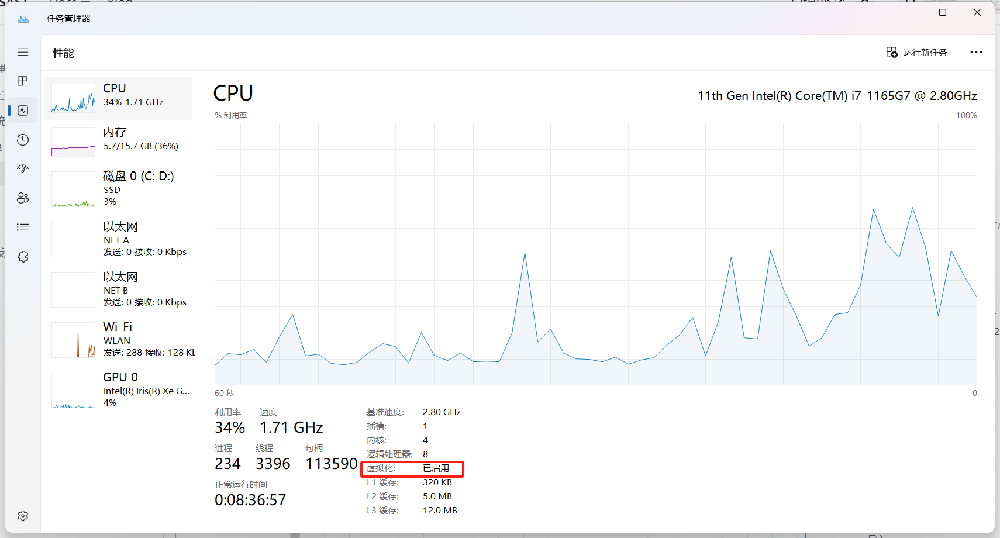
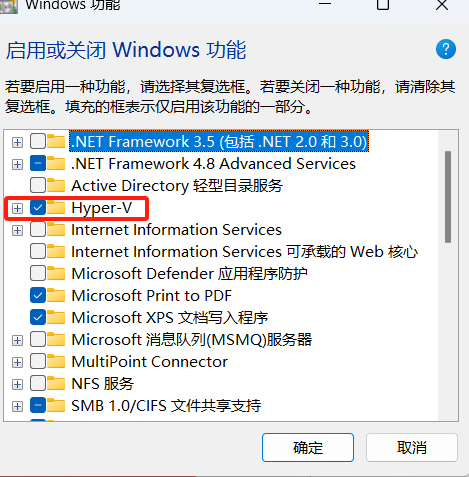
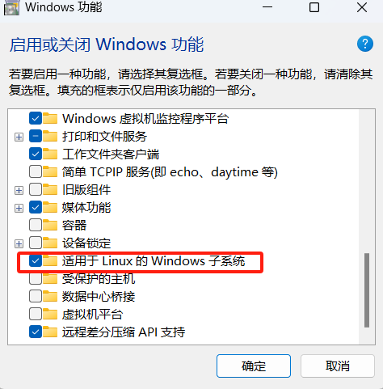
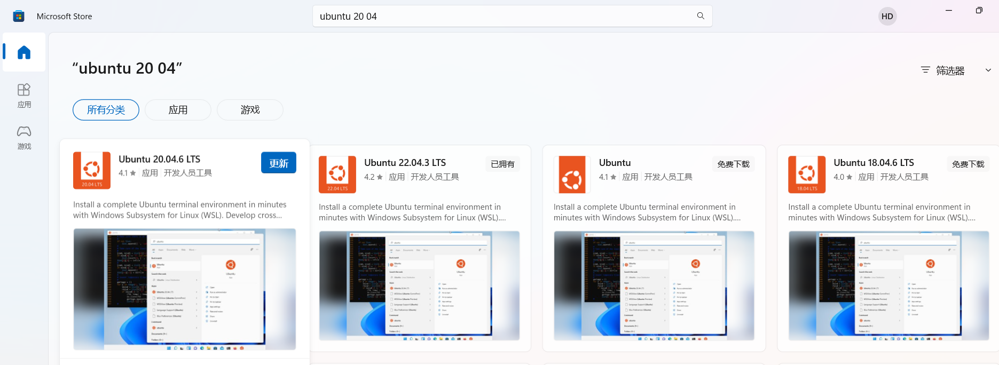
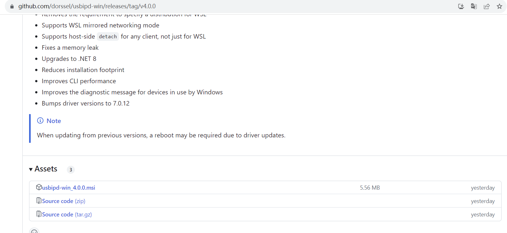
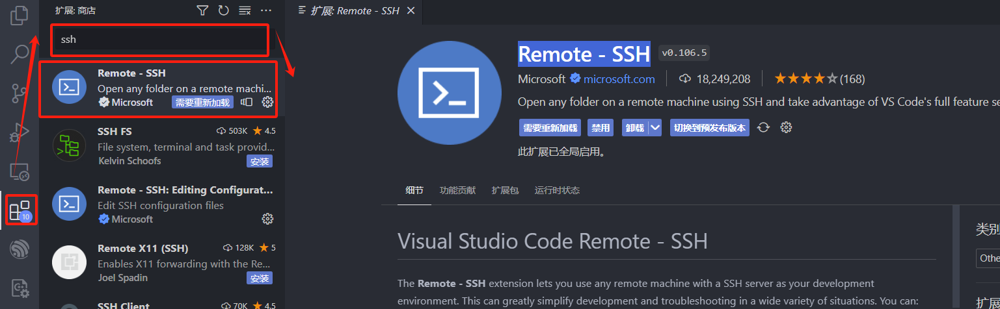
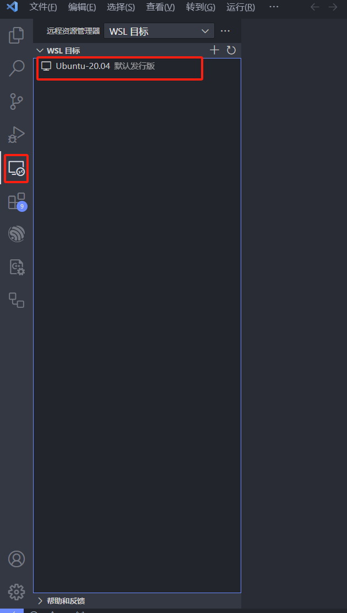
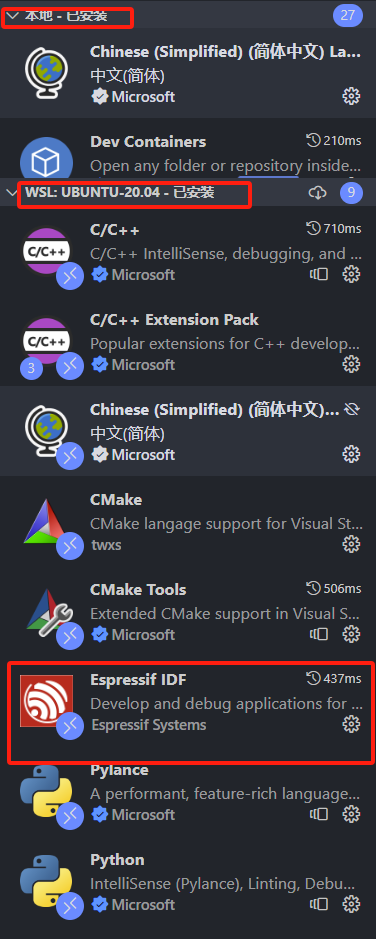
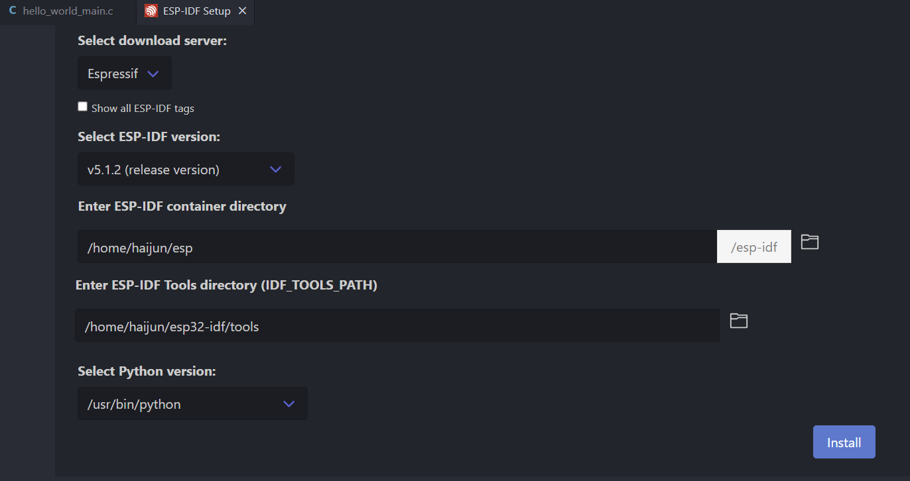
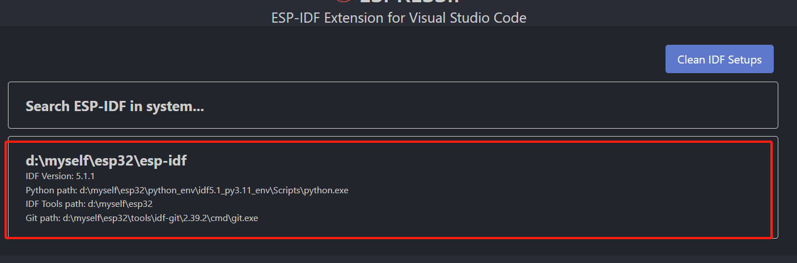

# 基于wsl安装esp32-idf开发环境

[toc]

编译时间对比

均编译`Heelo_Wold`demo(（先清除编译，再开始编译）

| Windows  | wsl      |
| -------- | -------- |
| 04:11.05 | 01:00.59 |

## wsl 安装

WSL（Windows Subsyetem for Linux） 目前已发布两代产品：WSL1 和 WSL2。WSL2 则利用 Windows 的 Hyper-V 功能，通过虚拟化技术直接运行 Linux 虚拟机，更接近原生 Linux 操作系统体验。

**注意：以下的wsl均指wsl2**

### 1. 检查 BIOS 是否开启了虚拟化

`ctrl+shfit+esc`进入任务管理器，查看 BIOS 是否开启虚拟化。



如果显示禁用，则要进入BIOS，在`config`中将`Intel Virtual Technology`设置为`true`。

### 2. 启用wsl功能

打开控制面板 -> 程序和功能 -> 启动或关闭Windows功能 -> Hyper & 适用于linux的Windows系统-> 点击确认，等待安装完成。





### 3.安装 Ubuntu

直接在Microsoft Store中搜索“ubuntu”



直接选择安装即可。

安装完毕后，点击“启动”，或者按 `Win+R`，输入 `wsl`，即可开始按照提示创建用户名（username）和密码（password）了。

之后，可以在 `Win+R` 中输入 `wsl`，开始WSL。

## 安装usbipd-win

wsl无法获取USB设备，必须使用usbipd-win将连接到windows上的usb设备转接到wsl中。

### 1. 下载

在g[ithub](https://github.com/dorssel/usbipd-win/releases/tag/v4.0.0)中下载最新的usbipd-win[^1]



直接点击`subipd-win.msi`安装，安装完毕后根据提示重启电脑

### 2. 常用命令

1. `usbipd attach`

```bash
Description:
	连接一个USB设备到客户端
	
Usage:
  usbipd attach [options]

Options:
  -a, --auto-attach                     当设备断开时，重新连接
  -b, --busid <BUSID>                   通过 <BUSID>连接设备
  -i, --hardware-id <VID:PID>            通过<VID>:<PID>连接设备
  -w, --wsl <[DISTRIBUTION]> (REQUIRED)  链接到WSL（可以指定Ubuntu的版本）
  -?, -h, --help                         显示帮助信息
```

2. `usbipd bind`

```bash
Description:
	注册一个设备用于共享

Usage:
  usbipd bind [options]

Options:
  -b, --busid <BUSID>          通过 <BUSID>共享设备
  -f, --force                  强制绑定，Windows无法使用
  -i, --hardware-id <VID:PID>  通过 <VID>:<PID>共享设备
  -?, -h, --help               帮助
```

3. `usbipd detach `

```bash
Description:
	断开一个或者多个设备
	
Usage:
  usbipd detach [options]

Options:
  -a, --all                    断开所以设备
  -b, --busid <BUSID>          断开 <BUSID>设备
  -i, --hardware-id <VID:PID>  断开 <VID>:<PID>设备
  -?, -h, --help               帮助
```

4. `usbipd list`

列出当前连接的 USB 设备

5. `usbipd unbind`

```bash
Description:
  	取消共享，如果设备已经连接到其他客户端，设备立即和客户端断开

Usage:
  usbipd unbind [options]

Options:
  -a, --all                    停止共享所有设备
  -b, --busid <BUSID>          停止<BUSID>设备
  -g, --guid <GUID>            Stop sharing persisted device having <GUID>
  -i, --hardware-id <VID:PID>  停止共享 <VID>:<PID>设备
  -?, -h, --help               帮助
```

### 3. 使用demo

#### 挂载设备

常用命令

```bash
# 1.查看帮助，可以列出所有的usbipd命令
usbipd --help
# 2. 列出目前所有的USB设备
usbipd list
# 3. 共享某个设备
usbipd bind --busid=<BUSID>
# 4. 将设备挂载在wsl下
usbipd attach -wsl --busid=<BUSID>
```

1. 将esp32连接到电脑；

2. 在Windows下打开终端，通过`usbipd list`查看目前Windows下挂了哪些设备；

```bash
PS C:\Users\haijun> usbipd list
Connected:
BUSID  VID:PID    DEVICE                                                        STATE
2-1    17ef:60ff  USB 输入设备                                                  Not shared
2-3    06cb:00fc  Synaptics UWP WBDI                                            Not shared
2-4    174f:2454  Integrated Camera, Integrated IR Camera                       Not shared
2-7    303a:1001  USB 串行设备 (COM8), USB JTAG/serial debug unit               Not shared
2-10   8087:0026  英特尔(R) 无线 Bluetooth(R)                                   Not shared
```

可知本台电脑，挂载5个设备，和esp32连接的USB设备为`2-7`，其状态为`not shared`。

3. 通过`usbipd bind`共享USB设备;

```bash
PS C:\Users\haijun> usbipd bind -b 2-7
```

再次查看设备状态

```bash
PS C:\Users\haijun> usbipd list       
Connected:
BUSID  VID:PID    DEVICE                                                        STATE
2-1    17ef:60ff  USB 输入设备                                                  Not shared
2-3    06cb:00fc  Synaptics UWP WBDI                                            Not shared
2-4    174f:2454  Integrated Camera, Integrated IR Camera                       Not shared
2-7    303a:1001  USB 串行设备 (COM8), USB JTAG/serial debug unit               Shared
2-10   8087:0026  英特尔(R) 无线 Bluetooth(R)                                   Not shared

Persisted:
GUID                                  DEVICE
5fcf8573-b9b6-4cbb-81e1-4cdafbb7982d  Silicon Labs CP210x USB to UART Bridge (COM3)
```

设备状态变成`shared`，说明共享成功。

**注意：一旦设备被共享，重新拔插以后，该设备仍处于共享状态，即对于同一设备，该命令只需要运行一次**

5. 通过`usbipd attach`将设备挂载到wsl下；

```bash
PS C:\Users\haijun> usbipd attach -w -b 2-7
usbipd: info: Using WSL distribution 'Ubuntu-20.04' to attach; the device will be available in all WSL 2 distributions.
usbipd: info: Using IP address 172.19.32.1 to reach the host.
```

再次查看设备状态

```bash
PS C:\Users\haijun> usbipd list
Connected:
BUSID  VID:PID    DEVICE                                                        STATE
2-1    17ef:60ff  USB 输入设备                                                  Not shared
2-3    06cb:00fc  Synaptics UWP WBDI                                            Not shared
2-4    174f:2454  Integrated Camera, Integrated IR Camera                       Not shared
2-7    1a86:55d3  USB-Enhanced-SERIAL CH343 (COM4)                              Shared
2-10   8087:0026  英特尔(R) 无线 Bluetooth(R)                                   Not shared

Persisted:
GUID                                  DEVICE
2abd5a66-7692-48f4-8cc4-f4b90ac84aff  USB 串行设备 (COM8), USB JTAG/serial debug unit
5fcf8573-b9b6-4cbb-81e1-4cdafbb7982d  Silicon Labs CP210x USB to UART Bridge (COM3)
```

设备状态变成`Attached`，说明挂载成功。

**注意：在使用 `usbipd attach -w -b 2-7`前必须先开启wsl**

6. 验证

在wsl中查看USB设备

```bash
haijun@zs-duhaijun:~$ ls /dev/ttyA*
/dev/ttyACM0
```

可以看出多了个`/dev/ttyACM0`设备

#### 卸载设备

```bash
# 卸载指定设备
PS C:\Users\haijun> usbipd detach -b 2-7
# or 卸载全部设备
usbipd detach -a
```

再次查看设备状态

```bash
PS C:\Users\haijun> usbipd list
Connected:
BUSID  VID:PID    DEVICE                                                        STATE
2-1    17ef:60ff  USB 输入设备                                                  Not shared
2-3    06cb:00fc  Synaptics UWP WBDI                                            Not shared
2-4    174f:2454  Integrated Camera, Integrated IR Camera                       Not shared
2-7    1a86:55d3  USB-Enhanced-SERIAL CH343 (COM4)                              Shared
2-10   8087:0026  英特尔(R) 无线 Bluetooth(R)                                   Not shared
```

可知设备变成`Shared`状态，说明卸载成功；

如果想停止共享使用`unbind`命令，因为只要卸载了设备，Windows下就可以正常使用了，所以一般不需要使用`unbind`.

如果不像每次`usbpipd list`时都看到以前共享的设备，但是目前又没有连接到电脑上的设备，可以使用`unbind`

```bash
usbipd unbind -g <GUID> 
```

## 安装esp32-idf开发环境

### 安装vscode-esp-idf插件

1. 检查`remote-ssh`插件是否安装；




2. 连接wsl；



3. 连接以后，安装ESP32-idf；

注意：本地安装的插件不会自动安装到wsl中，所以在安装ESP32-idf插件时，将和c、cmake、python相关的插件一起安装到wsl中




### 安装esp32开发环境

1. 在wsl环境中安装相关依赖

```bash
sudo apt-get install git wget flex bison gperf python3-pip python3-venv python3-setuptools cmake ninja-build ccache libffi-dev libssl-dev dfu-util
```

2. 在vscode中通过`ctr+shift+p`打开命令面板 -> 输入figcon`ESP-IDF:Config ESP-IDF extension`打开安装esp-idf安装界面。



* 下载服务器尽量选择`Espressif`，因为它可以防止因为网络问题，导致下载失败；
* esp-idf版本尽量选择最新的，即第一个（我原先选择过v5.1，可以正常下载，但是环境总有一点小问题：提示找不到编译链）
* 后面的安装路径随意；
* python版本默认就行

3. 等待安装完成

安装时间和网络有关，可以通过终端的输出查看安装信息，有任何的报错均会显示。

安装完成的界面如下


如果要使用openocd，请按照提示设置操作。

### 使用

通过`hello_world`demo检验是否可以正常编译和下载

在`hello_world.vscode/c_cpp_properties.json`中的编译路径显示正常，编译一般就不会出错。

下载时可能报以下错误：

```bash
A fatal error occurred: Could not open /dev/ttyACM0, the port is busy or doesn't exist.
([Errno 13] could not open port /dev/ttyACM0: [Errno 13] Permission denied: '/dev/ttyACM0'
```

原因：通过查询USB设备权限知道，设备没有可执行权限

```bash
haijun@zs-duhaijun:~$ ll /dev/ttyA*
crw------- 1 root root 166, 0 Dec  9 23:56 /dev/ttyACM0
```

解决：添加可执行权限

```bash
haijun@zs-duhaijun:~$ sudo chmod 700 /dev/ttyACM0 
[sudo] password for haijun: 
haijun@zs-duhaijun:~$ ll /dev/ttyA*
crwx------ 1 root root 166, 0 Dec 10 11:09 /dev/ttyACM0
```

### Windows和wsl编译环境来回切换

如果从wsl切换到Windows，esp-idf的插件会报以下乱码

```bash
Command failed: dfu-util --version
'dfu-util' �����ڲ����ⲿ���Ҳ���ǿ����еij���
���������ļ���
Error checking dfu-util version
Error: Command failed: dfu-util --version
'dfu-util' �����ڲ����ⲿ���Ҳ���ǿ����еij���
���������ļ���
```

这应该是sp-idf的插件配置使用的是wsl那一套，导致环境不兼容。需要手动选择选择下环境

1. 通过`ctr+shift+p`打开命令面板 -> 输入figcon`ESP-IDF:Config ESP-IDF extension`打开安装esp-idf安装界面。
2. 点击`USE EXISTING SETUP`

3. 选择在Windows下的安装路径



等待它重新安装虚拟环境。

[^1]: https://github.com/dorssel/usbipd-win/releases/tag/v4.0.0

