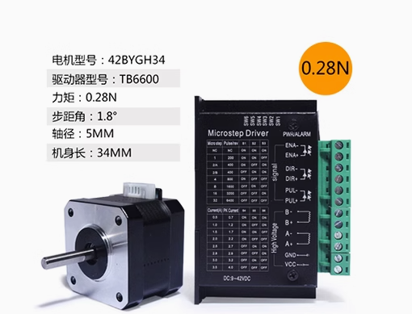
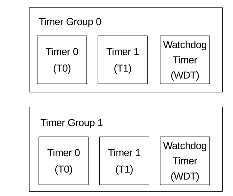
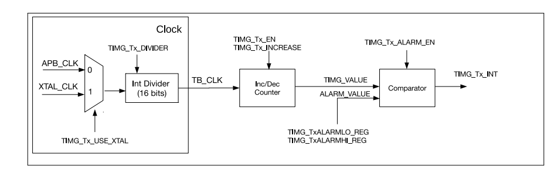

# esp32-驱动步进电机

[toc]

## 步进电机

所使用的步进电机和驱动器如下：



驱动器的引脚

| 引脚名称  | 引脚定义     |
| --------- | ------------ |
| ENA-(ENA) | 输出使能负端 |
| ENA+(ENA) | 输出使能正端 |
| DIR-(DIR) | 方向控制负端 |
| DIR+(DIR) | 方向控制正端 |
| PUL-(PUL) | 脉冲控制负端 |
| PUL+(PUL) | 脉冲控制正端 |
| B-        | B相正        |
| B+        | B相负        |
| A+        | A相正        |
| A-        | A相负        |
| GND       | 电源地       |
| VCC       | 电源正       |

- EAN：控制输出信号是否使能，当EAN有效时，输出关闭，电机绕组电流为零， 电机为无力矩状态，可以自由转动电机，适合需要手动调整电机的场合。
- DIR：控制电机的转动方向，当此信号有效时，电机顺时针转动，当此信号无效时，电机逆时针旋转。
- PUL：控制电机转动，驱动器接收到的脉冲信号电机就会按照既定的方向旋转。电机的角位移与脉冲的数量成正比， 速度与脉冲的频率成正比。通常脉冲的有效宽度>=5us，频率<=125KHz。

控制器的有两组拨码开关，用于控住细分和电流：

- 细分设置：步进电机的步进角都是1.8°， 因此电机旋转一圈需要360° /1.8° =200个脉冲，若细分选择16，则表示不仅电机转一圈需要200*16=3200个脉冲；
- 电流设置：电流值需要根据步进电机的额定电流来设定。 一般建议驱动器的输出电流设定和电机额定电流差不多或者小一点；

驱动器的接线方式一般分为共阴极和供阳极两种：

共阴极接法如图所示：


共阳极接法如图所示：


## 控制方法

通过对步进电机的驱动器了解，可知控制步进电机需要使用3个GPIO：

- 使能端：一个普通的GPIO，能输出高低电平；
- 方向端：一个普通的GPIO，能输出高低电平；
- 脉冲端：能够输出脉冲数可控的GPIO；

ESP32有PWM的输出外设，但是没有发现能控制脉冲个数的方式（可能是我对该外设了解不清楚），因此采用**定时器+GPIO**的方式，使其能输出可控的脉冲

## ESP32S3 定时器外设

ESP32-S3 包含两个定时器组，即定时器组 0 和定时器组 1



定时器具有如下功能：

- 16 位时钟预分频器，分频系数为 2 到 65536
- 54 位时基计数器可配置成递增或递减
- 可读取时基计数器的实时值
- 暂停和恢复时基计数器
- 可配置的报警产生机制
- 计数器值重新加载（报警时自动重新加载或软件控制的即时重新加载）
- 电平触发中断

定时器的架构如下：



1. 时钟源的选择，可以选择APB时钟源（APB_CLK）或者外部时钟（XTAL_CLK ），时钟源16 位预分频器分频，产生时基计数器使用的时基计数器时钟TB_CLK。

2. 54 位时基计数器：54 位时基计数器基于 TB_CLK，每经过TB_CLK，技计数值递增或者递减。其中，时钟使能（TIMG_Tx_EN 能控制计数器的是否停止；

3. 比较器：当当计数值和设定的报警值一致时，触发定时器中断；

## 定时器的配置

当然，esp32是不需要我们操作寄存器的，只需要按照官方说明进行配置即可

### 1 资源分配

配置结构体：`gptimer_config_t`

成员：

- `clk_src`：选择定时器的时钟源
- `direction`：设置定时器的计数方向
- `resolution_hz` 设置内部计数器的分辨率
- `intr_priority` 设置中断的优先级。如果设置为 `0`，则会分配一个默认优先级的中断，否则会使用指定的优先级。
- `flags`
  - `intr_shared`
  - `backup_before_sleep`

配置结构体传递给`gptimer_new_timer()`

```c
/*创建定时器*/
    gptimer_handle_t gptimer = NULL;
    /*定时器计数周期1us*/
    gptimer_config_t timer_config = {
        .clk_src = GPTIMER_CLK_SRC_DEFAULT,         // APB时钟源
        .direction = GPTIMER_COUNT_UP,              // 向上计数
        .resolution_hz = 1 * 1000 * 1000,           // 计数分辨率（1MHz）
        .intr_priority = 0,                         // 中断优先级:默认
    };
    gptimer_new_timer(&timer_config, &gptimer);
```

### 2 设置报警动作

配置结构体 `gptimer_alarm_config_t`

成员

- `alarm_count`:设置触发警报事件的目标计数值
- `reload_count` 代表警报事件发生时要重载的计数值
- `flags.auto_reload_on_alarm` 标志设置是否使能自动重载功能

配置结构体传递给`gptimer_set_alarm_action()`

```c
 /*设置周期性动作*/
    gptimer_alarm_config_t alarm_config = {
        .alarm_count = 50,                         // 事件周期50us
        .reload_count = 0,                         //  重新加载的计数值为0
        .flags.auto_reload_on_alarm = true         //  自动重载
    };
    gptimer_set_alarm_action(gptimer, &alarm_config);
```

设置为周期性动作，定时周期为50us。

### 3. 注册事件回调函数

通过`gptimer_register_event_callbacks()`将函数挂载到中断服务例程 (ISR)。请在 `gptimer_enable() `之前调用这一函数

```c
/*设置周期性回调函数*/
    gptimer_event_callbacks_t cbs = {
        .on_alarm = generate_pluse_motor_cb
    };
    gptimer_register_event_callbacks(gptimer, &cbs, &expected_value);
```

回调函数

```c
/**
 * @brief       定时器周期事件回调函数
 * @details     使用GPIO4产生脉冲信号
 * @param       timer: 定时器句柄
 * @param       edata: 事件数据
 * @param       user_data: 用户数据
 * @return      无
 */
static bool generate_pluse_motor_cb(gptimer_handle_t timer, const gptimer_alarm_event_data_t *edata, void *user_data)
{
    uint16_t exp_pluse = *(uint32_t *)(user_data);
    static uint16_t count;
    count++;
    if(count > 2*exp_pluse)
    {
        count = 0;
        gptimer_stop(timer);
    }
    else{
        gpio_set_level(PLUSE_GPIO, count % 2);
    }
    
    return true;
}
```

回调函数中，则是每次进入定时器中断就翻转电平，即脉冲的周期为50us*2=100us，另外通过`user_data`将期望的脉冲数带入回调函数，一旦达到期望脉冲数则停止定时器，实现脉冲数可控的目标。

### 4 使能和禁用定时器

```c
    /*使能定时器*/
    gptimer_enable(gptimer);
```

### 5 启动或者停止定时器

```c
  /*启动定时器*/
    // gptimer_start(gptimer);
```

## GPIO 配置

```c
#define PLUSE_GPIO  GPIO_NUM_4          // 步进电机脉冲
#define DIR_GPIO    GPIO_NUM_5          // 步进电机方向
#define ENABLE_GPIO  GPIO_NUM_48         // 步进电机使能

/*配置GPIO: 配置为输出*/
    gpio_config_t io_conf = {
        .intr_type = GPIO_INTR_DISABLE,               // 初始电平
        .mode = GPIO_MODE_OUTPUT,                    // 输出模式
        .pin_bit_mask = (1ULL << PLUSE_GPIO | 1ULL << DIR_GPIO | 1ULL << ENABLE_GPIO),
        .pull_down_en = GPIO_PULLDOWN_DISABLE,       // 禁止下拉
        .pull_up_en = GPIO_PULLUP_DISABLE           // 禁止上拉
    };
   gpio_config(&io_conf);
```

## 设置脉冲数和方向

```c
/**
 * @brief       设置脉冲数和转动方向
 * @param		timer: 定时器句柄
 * @param		*exp_pluse: 期望的脉冲数（和set_pluse一致，它将传入定时器的回调函数中）
 * @param		set_pluse：设置的脉冲数
 * @param		dir：控制方向
 */
bool set_pluse_count(gptimer_handle_t timer, uint32_t *exp_pluse, uint32_t set_pluse, int8_t dir)
{
    esp_err_t st;
    st = gptimer_start(timer);
    if(st == ESP_OK)
    {
        *exp_pluse = set_pluse;
        gpio_set_level(DIR_GPIO, dir);
        ESP_LOGI(TAG, "pluse=%ld, dir=%d", set_pluse, dir);
    }
    else{
        ESP_LOGE(TAG, "gptimer_start failed with %s", esp_err_to_name(st));
    }
    return st;
}
```

调用：

```c
while (1)
   {
        set_pluse_count(gptimer, &expected_value, 1600, 1);
        vTaskDelay(5000 / portTICK_PERIOD_MS);
        set_pluse_count(gptimer, &expected_value, 1600, 0);
        vTaskDelay(5000 / portTICK_PERIOD_MS);
  }
```

完整代码

```sh
git clone -b motor https://github.com/navy-to-haijun/esp32-s3.git
```

