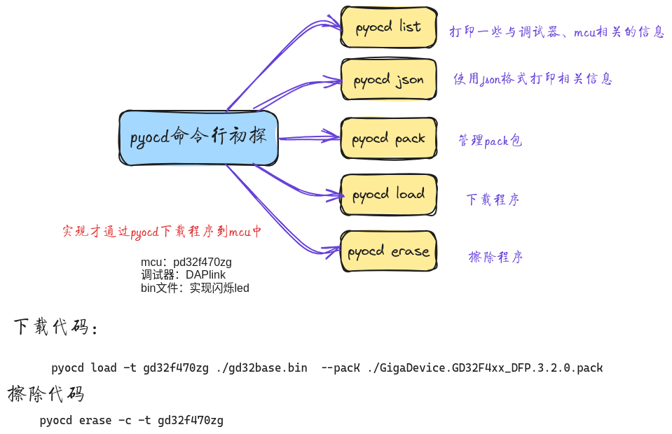
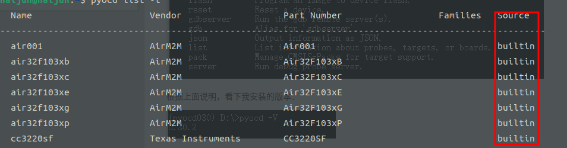

# pyocd 命令



## 准备工作

1. mcu：gd32f470zg；
2. 调试器：DAPlink；
3. bin文件：我准备了一个led灯闪烁的程序，方便观察；

```shell
pyocd -h
```

```shell
usage: pyocd [-h] [-V] [--help-options]  ...

PyOCD debug tools for Arm Cortex devices

options:
  -h, --help       show this help message and exit
  -V, --version    show program's version number and exit
  --help-options   Display available session options.

subcommands:
  
    commander (cmd)
                   Interactive command console.
    erase          Erase entire device flash or specified sectors.
    load (flash)   Load one or more images into target device memory.
    gdbserver (gdb)
                   Run the gdb remote server(s).
    json           Output information as JSON.
    list           List information about probes, targets, or boards.
    pack           Manage CMSIS-Packs for target support.
    reset          Reset a target device.
    server         Run debug probe server.
    rtt            SEGGER RTT Viewer/Logger.
```
核心子命令：
* `commander`：交互命令；
* `erase`：擦除flash或者指定扇区；
* `load(falsh)`：加载程序到指定muc中；
* `gdbserver (gdb)`：运行gdb服务；
* `json`：使用json输出信息；
* `list`：打印相关信息；
* `pack`：管理相应pack包；
* `reset`：重启目标设备；
* `server`：运行调试器服务器；
* `rtt`：实现SEGGER RTT Viewer/Logger；

本次只关注`list`、`json`、`pack`、`load(falsh)`、`erase`几个命令，旨在了解pyocd和能烧录程序

## pyocd list

首先查看帮助信息`pyocd list -h`
```shell
list output:
  -p, --probes          List available probes.
  -t, --targets         List all known targets.
  -b, --boards          List all known boards.
  --plugins             List available plugins.
```

* `-p`：显示可用的调试器
```shell
haijun@haijun:~$ pyocd list -p
  #   Probe/Board             Unique ID           Target  
----------------------------------------------------------
  0   ARM DAPLink CMSIS-DAP   lckfb.com-v1.1.0H   n/a 
```

看出调试器为DAPlink，ID为lckfb.com-v1.1.0H，连接的mcu没有识别出来，这代表gd32f470zg不是内置的，以后对于该mcu的任何操作必须显示指定mcu

* `-t` :列出所有支持的MCU；
```shell
pyocd list -t
```
通过打印可知gd32f470zg不在支持的列表中，说明需要手动安装gd32f470zg的支持包
* `-b`：列出支持的板卡，一般都用不上；
* `--plugins`：列出支持的调试器和实时操作系统；
```shell
haijun@haijun:~$ pyocd list --plugins
  Type          Plugin Name   Version   Description                                
-----------------------------------------------------------------------------------
  Debug Probe   cmsisdap      0.36.0    CMSIS-DAP debug probe                      
  Debug Probe   jlink         0.36.0    SEGGER J-Link debug probe                  
  Debug Probe   picoprobe     0.36.0    Raspberry Pi Pico Probe                    
  Debug Probe   remote        0.36.0    Client for the pyOCD debug probe server    
  Debug Probe   stlink        0.36.0    STMicro STLinkV2 and STLinkV3 debug probe  
  RTOS          argon         0.36.0    Argon RTOS                                 
  RTOS          freertos      0.36.0    FreeRTOS                                   
  RTOS          rtx5          0.36.0    RTX5                                       
  RTOS          threadx       0.36.0    ThreadX                                    
  RTOS          zephyr        0.36.0    Zephyr 
```

## pyocd json

帮助信息`pyocd json -h`
```shell
json output:
  -p, --probes          List available probes.
  -t, --targets         List all known targets.
  -b, --boards          List all known boards.
  -f, --features        List available features and options.
```

可知`json`也是打印相关信息，不过使用json格式，就不进一步演示了。
## pyocd pack
pyocd支持的MCU一部分是内置的，一部分是通过pack安装的。pack的相关子命令就是对pack包进项管理。

> pack包：和keil里面安装的pack包是一回事；

```shell
subcommands:
  
    clean               Delete the pack index and all installed packs.
    find                Report pack(s) in the index containing matching device part numbers.
    install             Download and install pack(s) containing matching device part numbers.
    show                Show the list of installed packs.
    update              Update the pack index.
```

* `clearn`：删除所有已经安装的pack包；
* `find`：查找具体的pack包，后面跟芯片的型号
* `install`：安装具体的pack包，后面跟芯片型号
* `show`：显示已经安装的pack包，可以通过该命令检查安装的pack包是否成功
* `update`：更新pack包的引用；

以安装gd32f470zg所需的支持包为demo
1. 使用`show`查看是否已经有gd32f470zg的pack包；
```shell
haijun@haijun:~$ pyocd pack show
  Pack   Version  
------------------
```
可知目前还没有安装任何pack包
>值得说明的是，pyocd有两种方式支持mcu，一种是内置(builtin)，一种是pack，可以通过`pyocd list -t`查看




2. 使用`find`查找gd32f470zg的pack包；

```shell
aijun@haijun:~$ pyocd pack find gd32f470zg
0000417 I No pack index present, downloading now... [pack_cmd]
  Part         Vendor       Pack                      Version   Installed  
---------------------------------------------------------------------------
  GD32F470ZG   GigaDevice   GigaDevice.GD32F4xx_DFP   3.0.3     False    
```
从最后的安装状态为false，知道该安装包未安装。
> No pack index present, downloading now... 是因为没有执行过`pyocd pack update`，所以会首先下载所有pack的索引

3. 使用`install`安装gd32f470zg的pack包；
```shell
haijun@haijun:~$ pyocd pack install  gd32f470zg
Downloading packs (press Control-C to cancel):
    GigaDevice.GD32F4xx_DFP.3.0.3
Downloading descriptors (001/001)

```

4. 再次通过`show`查看是否安装成功
```shell
haijun@haijun:~$ pyocd pack show
  Pack                      Version  
-------------------------------------
  GigaDevice.GD32F4xx_DFP   3.0.3    

```

pack安装成功。
## pyocd load

`load`的命令比较多，有用的为`connetion`和`load options`选项

```shell
connection:
  -u UNIQUE_ID, --uid UNIQUE_ID, --probe UNIQUE_ID
                        Select the debug probe by its full or partial unique ID. Optionally
                        prefixed with '<probe-type>:' where <probe-type> is the name of a probe
                        plugin.
  -t TARGET, --target TARGET
                        Set the target type. See available target types with 'pyocd list
                        --targets'.
  -f FREQUENCY, --frequency FREQUENCY
                        SWD/JTAG clock frequency in Hz. Accepts a float or int with optional case-
                        insensitive K/M suffix and optional Hz. Examples: "1000", "2.5khz", "10m".
  -W, --no-wait         Do not wait for a probe to be connected if none are available.
  -M MODE, --connect MODE
                        Select connect mode from one of (halt, pre-reset, under-reset, attach).
```

* `-u`：选择调试器，如果只有一个不用指定；
* `-t`：目标芯片，如果通过`list -p`发现其中的`target`没有显示，这该参数必须；
* `-f`：设置调试器频率；
* `-m`：选择连接模式；

```shell
load options:
  -e {auto,chip,sector}, --erase {auto,chip,sector}
                        Choose flash erase method. Default is sector.
  -a ADDR, --base-address ADDR
                        Base address used for the address where to write a binary. Defaults to
                        start of flash. Only allowed if a single binary file is being loaded.
  --trust-crc           Use only the CRC of each page to determine if it already has the same
                        data.
  --format {bin,hex,elf}
                        File format. Default is to use the file's extension. If multiple files are
                        provided, then all must be of this type.
  --skip BYTES          Skip programming the first N bytes. Binary files only.
  --no-reset            Specify to prevent resetting device after programming has finished.


```

* `-e`：擦除flash的方式；
* `-a`：下载的首地址；
* `--format`：程序的文件形式（bin  , hex  or idf）

当然，最简单的下载方式就是大部分保持默认，就像使用IAR和keil一样。

下载程序命令

```shell
pyocd load -t gd32f470zg ./gd32base.bin

```

终端显示：
```shell
 W Board ID lckf is not recognized [mbed_board]
Exception in thread load-svd:
Traceback (most recent call last):
  File "/usr/lib/python3.10/threading.py", line 1016, in _bootstrap_inner
    self.run()
  File "/usr/local/lib/python3.10/dist-packages/pyocd/debug/svd/loader.py", line 72, in run
    self._svd_location.load()
  File "/usr/local/lib/python3.10/dist-packages/pyocd/debug/svd/loader.py", line 48, in load
    self.device = SVDParser.for_xml_file(self.filename).get_device()
  File "/usr/local/lib/python3.10/dist-packages/pyocd/debug/svd/parser.py", line 74, in for_xml_file
    return cls(ET.parse(path), remove_reserved)
  File "/usr/lib/python3.10/xml/etree/ElementTree.py", line 1222, in parse
    tree.parse(source, parser)
  File "/usr/lib/python3.10/xml/etree/ElementTree.py", line 580, in parse
    self._root = parser._parse_whole(source)
xml.etree.ElementTree.ParseError: XML or text declaration not at start of entity: line 1, column 2
0000837 W Invalid coresight component, cidr=0x0 [rom_table]
0000864 I Loading /home/haijun/vmware/share/liangshanpi/code/base_project_IAR/Project/Debug/Exe/gd32base.bin [load_cmd]
[==================================================] 100%

```

可知程序下载完成，但是有有报错，虽然不影响下载，但是影响视觉。这是因为pack包的原因。我们可以在gd32官方网站上下载gd32f470zg的pack包。在下载时手动指定使用的pack包

```shell
pyocd load -t gd32f470zg ./gd32base.bin  --pacK ./GigaDevice.GD32F4xx_DFP.3.2.0.pack
```

终端显示：
```shell
000416 W Board ID lckf is not recognized [mbed_board]
0000731 W Invalid coresight component, cidr=0x0 [rom_table]
0000762 I Loading /home/haijun/vmware/share/liangshanpi/code/base_project_IAR/Project/Debug/Exe/gd32base.bin [load_cmd]
[==================================================] 100%
0001193 I Erased 0 bytes (0 sectors), programmed 0 bytes (0 pages), skipped 2048 bytes (2 pages) at 4.64 kB/s [loader]

```

擦除程序

## pyocd erase

用于擦除扇区
```shell
rase options:
  -c, --chip            Perform a chip erase.
  -s, --sector          Erase the sectors listed as positional arguments. This is the default.
  --mass                Perform a mass erase. On some devices this is different than a chip erase.

```

- `-c`：擦除整个扇区；
- `-s`：擦除指定扇区；
- `--mass`：批量擦除；

擦除整个扇区

```shell
pyocd erase -c -t gd32f470zg
```