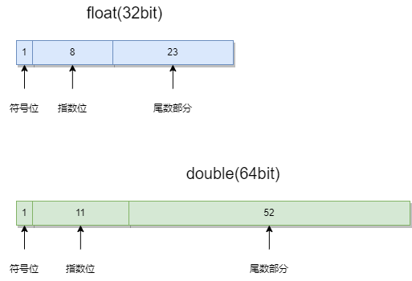
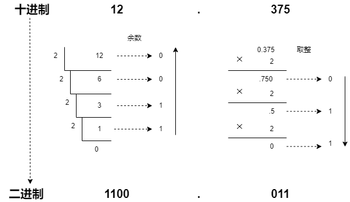
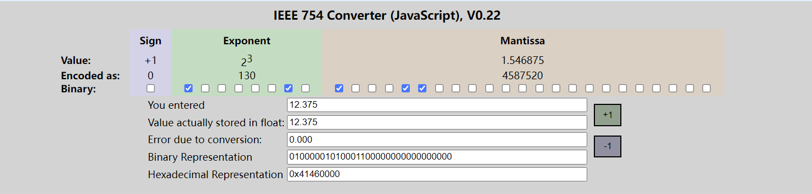
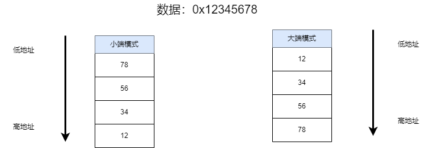

# MCU和PC通信：浮点数传输

[toc]

上次做mpu6050可视化时，匿名上位机对于浮点的处理为扩大100倍，然后转化为整数进行传输。那是就疑惑，扩大一定倍数，然后转化为整数，相当于牺牲了float数的精度，当然，对于一般的场景，对于float的精度要求并不高。但是，是否有不影响float的精度的条件下，完成float的数据传输？

发送float的核心在于**如何将表示float的四个字节**提取出来，如何在PC端将**四个字节还原成float**？

## flaot 发送的常见两种方案

当然有了，以下两种方案比较常见

* 使用`union`：`union`中的成员共享内存，如果`union`中的成员为`uint8 u8data[4]`和`float fdata`，我们对于`fdata`成员赋值以后，`float`的四个字节存储在`u8data`数组中，在发送时只需要发送` u8data[4]`，自然可以把表示floatd的四个字节发送出去；

```c
/*声明一个共用体*/
typedef union 
{
    uint8_t u8data[4];
    float fdata;
}float_to_u8;
/*定义*/
float_to_u8 data;
/*写入float*/
data.fdata = 12.375;
/*发送flaot*/
sendto(..., data.u8data, sizof(data.u8data), ...)

```

* 使用指针：float占用四个字节，定义一个指针`uint8 *p`， 让指针`p`指向flaot的首地址，然后不断移动指针，就可以依次读取flaotd的四个字节；

```c
/*定义一个flaot*/
flaot data = 12.375;
/*定义一个指针*/
uint8 *p;
/*指针指向data的地址*/
p = &data;
/*发送*/
for(int i; i< sizeof(float); i++)
{
    sendto(.., *(p + i), 1, ...)
}
```

## flaot传输测试

测试使用`union`方案

MCU和PC的传输方式使用udp，MCU使用esp32s3，PC端的数据解析使用python

传输的数据为3个flaot，模拟mpu6050 的欧拉角传输

### ESP32 端：打包四字节

```c
/*
* 声明共用体
*/
typedef union 
{
    uint8_t u8data[4];
    float fdata;
}float_to_u8;

/*定义共用体数组*/
float_to_u8 euler_mpu[3];
/*初值*/
euler_mpu[0].fdata = 0.0001;
euler_mpu[1].fdata = 1.1234;
euler_mpu[2].fdata = 123.123;

while()
{
    *发送*/
    sendto(sock, euler_mpu, sizeof(euler_mpu), 0, (struct sockaddr *)&dest_addr, sizeof(dest_addr));
    /*修改值*/
    euler_mpu[0].fdata += 0.0001;
    euler_mpu[1].fdata += 0.1;
    euler_mpu[2].fdata += 100;
    
    vTaskDelay(1000 / portTICK_PERIOD_MS);
}
```

### PC端：解析四字节

```python
import socket
import struct

def main():
    udp_addr = ('192.168.7.7', 8888)
    # UDP通信类型
    udp_socket = socket.socket(socket.AF_INET, socket.SOCK_DGRAM)
    udp_socket.bind(udp_addr)

    while True:
        # 等待接收数据
        buff, addr = udp_socket.recvfrom(1024) 
        print(f'[From {addr[0]}:{ addr[1]}]:resive {len(buff)} bytes')
        # 判断数据是否为12个
        if len(buff) == 12:
            data = struct.unpack('<fff', buff)
            print(data)
            print()

        
if __name__ == '__main__':
    main()

```

解析使用`struct`类进行。

`data = struct.unpack('<fff', buff)`

* `struct.unpack`：将字节流解析成相应格式化的数据；
* `<fff`：`>`表示数据为大端模式，`f`表示解析成float型；

结果：

```bash
[From 192.168.7.2:58248]:resive 12 bytes
(9.999999747378752e-05, 1.1233999729156494, 123.12300109863281)

From 192.168.7.2:58248]:resive 12 bytes
(0.00019999999494757503, 1.2233999967575073, 223.1230010986328)

[From 192.168.7.2:58248]:resive 12 bytes
(0.00029999998514540493, 1.3234000205993652, 323.12298583984375)

[From 192.168.7.2:58248]:resive 12 bytes
(0.00039999998989515007, 1.4234000444412231, 423.12298583984375)

[From 192.168.7.2:58248]:resive 12 bytes
(0.0004999999655410647, 1.523400068283081, 523.1229858398438)
```

## 内容扩展

float的传输过程挺简单，但是存在三个问题：

* float数据在计算机的存储方式是什么？
* 数据的大小端模式？
* `struct`类的其他用法？

###  float的存储方式

#### 存储原理

在C中，浮点类型的数据采用单精度类型`float`和双精度类型`double`来存储，float数据占用32bit，double数据占用64bit。float遵从的是IEEE R32.24 规范，而double 遵从的是R64.53规范。

无论是单精度还是双精度在存储中都分为三个部分：

1. 符号位（Sign）：0代表正，1代表负；
2. 指数位（Exponent）：用于存储科学计数法中的指数数据，并且采用移位存储；**float的指数位为8，double的指数位11**
3. 尾数部分（Mantissa）：尾数部分；**float的尾数位为23，double的尾数位为52**



> 1. 上面所说的**科学计数法**指二进制的下的指数计数法；
>
> 2. 上面所说的**移位存储**是因为指数有正有负，以float来说，其指数范围为`-127 - 128`，因此存储的数据为`原数据+127`

#### demo

假如一个`float`数为$12.375$（不要选择不能精准转化为二进制的数）

步骤：

1. 将十进制的数转化为二进制的数；
2. 将二进制的数用科学计数法表示为$1.M\times2^E$；
3. 将指数$E+127$，表示指数位；
4. $M$则是尾数部分，不足23位补零；

对于$12.375$来说，转为二进制：$1100.011$



> 对于整数部分：**除2取余，逆序排列**；
>
> 对于小数部分：**乘2取整，顺序排列**

使用科学计数法为$1.100011\times2^3$，

对于指数$3$，移位存储：，**指数位**的值为`3+127=130`，转化为二进制为$1000 \ 0010$

尾数部分则为$1000 \ 1100 \ 0000 \ 0000 \ 0000 \ 000$

符号位正，所以符号位为0；

所以$12.375$的在存储为$0 \ 10000010 \ 10001100000000000000000$

通过网上的在线工具查询，$12.375$d的二进制计算正确



代码测试（PC）

```c
#include"stdio.h"
#include <stdlib.h>

int main()
{
    float fdata = 13.375;
    unsigned char *p;
    p = (unsigned char *)&fdata;

    for (int i = 0; i < 4; i++)
    {
        printf("0x%x\n",   *(p+i));
    }
    printf("\n");
    return 0;
}
```

输出：

```
0x0     0x0     0x46    0x41
```

和代码测试和网上在线工具测试的不一致，是因为数据字序存在大小端之分。

### 大小端模式

int和float都是4个字节，那自然就存在一个问题，即是高字节在前还是低字节在前面。因此就出现两种字序，大端模式和小端模式。

1. 大端模式：**数据的低位存在内存的高地址中，而数据的高位存在内存的低地址中**。
2. 小端模式：**数据的低位存在内存的低地址中，而数据的高位存在内存的高地址中。**



在X86电脑上验证

```c
int main()
{
    int fdata = 0x12345678;
    unsigned char *p;
    // 指针p指向fdata的地址
    p = (unsigned char *)&fdata; 
    printf("十六进制: 0x%x\n", fdata);

    for (int i = 0; i < 4; i++)
    {
        printf("第%d寄存器地址: %p, 值: 0x%x\n",  i, p+i, *(p+i));
    }
    printf("\n");
}
```

输出：

```bash
六进制: 0x12345678
第0寄存器地址: f99c22e8, 值: 0x78
第1寄存器地址: f99c22e9, 值: 0x56
第2寄存器地址: f99c22ea, 值: 0x34
第3寄存器地址: f99c22eb, 值: 0x12
```

可知，x86为的字序为大端模式。

用相同的代码在在esp32上验证：

```bash
六进制: 0x12345678
第0寄存器地址: 0x3fc996a0, 值: 0x78
第1寄存器地址: 0x3fc996a1, 值: 0x56
第2寄存器地址: 0x3fc996a2, 值: 0x34
第3寄存器地址: 0x3fc996a3, 值: 0x12
```

可知，esp32为的字序为大端模式。

如果再去查STM32，它应该是小端模式。

### python struct模块

`struct`模块提供了用于在字节字符串和Python原生数据类型之间转换函数。`Struct`支持将数据packing(打包)成字节字符串，并能从字节字符串中逆向unpacking(解压)出数据。

它具有以下功能：

* 按照指定格式将Python数据转换为字节字符串,该字符串为字节流。如网络传输时，不能传输int，此时先将int转化为字节流，然后再发送;
* 按照指定格式将字节流转换为Python指定的数据类型;

相关函数如下：

| 函数                 | 返回值      | 说明                                                         |
| -------------------- | ----------- | ------------------------------------------------------------ |
| pack(fmt,v1,v2…)     | string      | 按照给定的格式(fmt),把数据转换成字符串(字节流),并将该字符串返回. |
| unpack(fmt,v1,v2…..) | tuple       | 按照给定的格式(fmt)解析字节流,并返回解析结果                 |
| calcsize(fmt)        | size of fmt | 计算给定的格式(fmt)占用多少字节的内存，注意对齐方式          |

> 还有两个函数，因为用得不多，没有列

其中所谓的**指定格式有格式符号和对其方式组成**

格式符号：

| 格式 | C 类型             | Python 类型       | 标准大小 |
| ---- | ------------------ | ----------------- | -------- |
| x    | 填充字节           | 无                |          |
| c    | char               | 长度为 1 的字节串 | 1        |
| b    | signed char        | 整数              | 1        |
| B    | unsigned char      | 整数              | 1        |
| ?    | _Bool              | bool              | 1        |
| h    | short              | 整数              | 2        |
| H    | unsigned short     | 整数              | 2        |
| i    | int                | 整数              | 4        |
| I    | unsigned int       | 整数              | 4        |
| l    | long               | 整数              | 4        |
| L    | unsigned long      | 整数              | 4        |
| q    | long long          | 整数              | 8        |
| Q    | unsigned long long | 整数              | 8        |
| n    | ssize_t            | 整数              |          |
| N    | size_t             | 整数              |          |
| e    | (6)                | float             | 2        |
| f    | float              | float             | 4        |
| d    | double             | float             | 8        |
| s    | char[]             | 字节串            |          |
| p    | char[]             | 字节串            |          |
| P    | void*              | 整数              |          |

对齐方式：

| Character | Byte order             | Size     | Alignment          |
| :-------- | :--------------------- | :------- | :----------------- |
| `@`       | native（本机）         | native   | native，凑够四字节 |
| `=`       | native（本机）         | standard | none，按照原字节   |
| `<`       | little-endian（小端）  | standard | none，按照原字节   |
| `>`       | big-endian（大端）     | standard | none，按照原字节   |
| `!`       | network (= big-endian) | standard | none，按照原字节   |

​	测试：将$12.375$打包字符串，再将字符串解包为float数。


```python
if __name__ == '__main__':
    # 格式化为字符串
    a = 12.375
    print(f"原始浮点数: {a}")
    
    print(f"'>f'格式占用字节数: {struct.calcsize('>f')}")
    buff = struct.pack('>f', 12.375)
   # 字符串格式不容易看懂，转化为16进制
    print("16进制:", end="\t")
    for data in buff:
        print(hex(data), end="\t")
    print()
    # 将字符串格式为float(大端模式)
    print("字符串转float:", end="\t")
    a = struct.unpack('>f', buff)[0]
    print(a)
```

输出
```bash
原始浮点数: 12.375
'>f'格式占用字节数: 4
16进制: 0x41    0x46    0x0     0x0
字符串转float:  12.375
```

## 小结

* 当然，无论MCU和谁通信，一般对方都规定了通信协议，因此我们只要按照通信协议书写就行。之所以研究研究float的数据传输，一方面是想复习下float的存储方式和大小端。另一方面，想自己在PC端可视化数据。因为只有自由度原越高，才能学习到更多东西，以后的复用性越强。

下一步，想在PC上可视化欧拉角数据，欧拉角额理论传输速率为100HZ，所以得保证数据的曲线的流畅度。不知道基于`python`是否有推荐的库？


 
