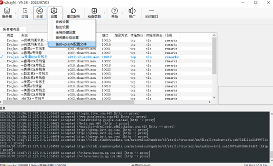

# v2ray for linux

v2ray 支持多平台：

- Windows 7 及之后版本（x86 / amd64 / arm32）；
- macOS 10.10 Yosemite 及之后版本（amd6 / arm64）；
- Linux 2.6.23 及之后版本（x86 / amd64 / arm / arm64 / mips64 / mips / riscv64）；
  - 包括但不限于 Debian 7 / 8、Ubuntu 12.04 / 14.04 及后续版本、CentOS 7 / 8、Arch Linux 等；
- FreeBSD (x86 / amd64)；
- OpenBSD (x86 / amd64)；
- Dragonfly BSD (amd64)；

本次主要研究在linux平台上的使用，**在linux中建立守护进程运行v2ray，使其不占用终端，并实现开机自启。**

## 准备工作-`.josn`配置文件

v2ray既可以作为客户端也可以作为服务端。作为梯子，在Windows端一般为客户端，在linux端则是看如何配置。客户端和服务端区分不明显。但是linux端需要一个`.json`的配置文件，从各种途径得到的订阅文件均需要转化为`.josn`的配置文件才能在v2ray中运行。其中Windows端的v2ray可以直接从订阅文件得到`.json`的配置文件。

导出位置：设置->备份v2ray配置文件。



## 下载

```

https://github.com/v2ray/v2ray-core

https://github.com/v2fly/v2ray-core/releases/tag/v4.31.0

# 选择对应版本
```

根据自我电脑要求，我下载[v2ray-linux-64.zip](https://github.com/v2fly/v2ray-core/releases/download/v4.31.0/v2ray-linux-64.zip)版本。

并将导出的配置文件复制到linux中改名为`congfig.json`（改名不是必须，但是配置文件必须存在）

## 通过命令行检测是否能正常运行

解压，并将`v2ray`移植到`/opt/`下

首先保证v2ray可以正常运行

```shell
# 检查是否可以运行
./v2ray help
# 查询运行命令
./v2ray help run
# 执行
/opt/v2ray/v2ray run -c /opt/v2ray/config.json
```

## 建立守护进程

一旦命令行能正常运行，则可以将启动v2ray命令写到守护进程中。

`sudo vim /etc/systemd/system/v2ray.service`

```shell
[Unit]
Description=v2ray
[Service]
Type=simple
ExecStart=/opt/v2ray/v2ray run -c /opt/v2ray/config.json
[Install]
WantedBy=multi-user.target
Alias=v2ray.service
```

在终端中写入环境变量（或者直接写到./bashrc中）

```shell
export all_proxy="socks://127.0.0.1:10808/"
export http_proxy="http://127.0.0.1:10809/"
export https_proxy="http://127.0.0.1:10809/"

# 启动V2ray
sudo systemctl start v2ray

# 检查V2ray状态
sudo systemctl status v2ray

# 设置V2ray开机自启动
sudo systemctl enable v2ray
```

测试

```shell
curl -i google.com
```

可视化网络设置

效果和命令一致。

```bash
export all_proxy="socks://127.0.0.1:10808/"
export http_proxy="http://127.0.0.1:10809/"
export https_proxy="http://127.0.0.1:10809/"
```

系统设置

`设置->网络`

.png)