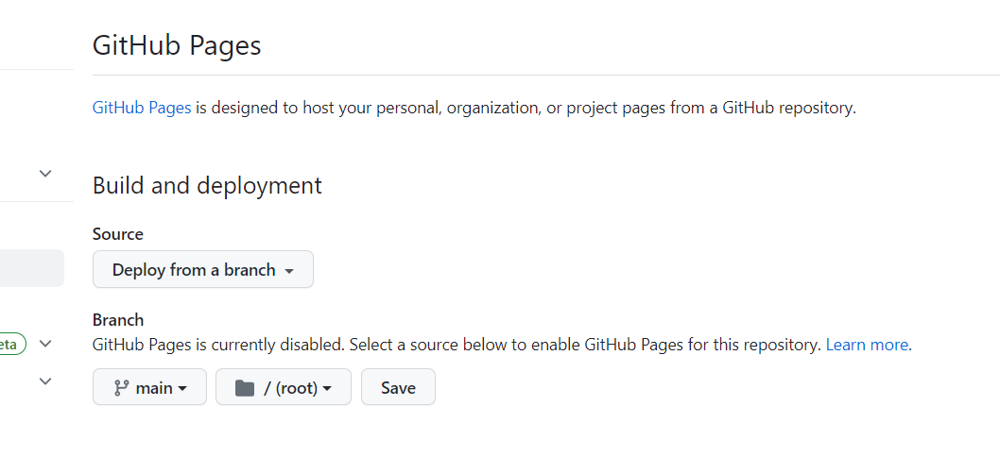
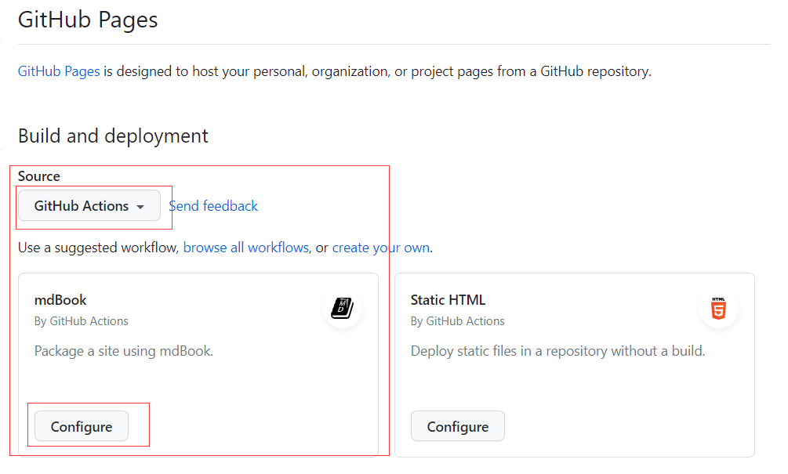
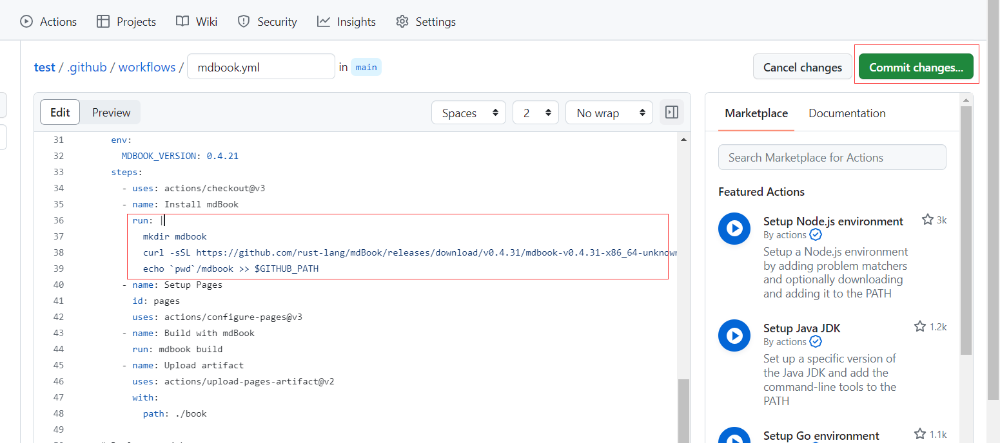
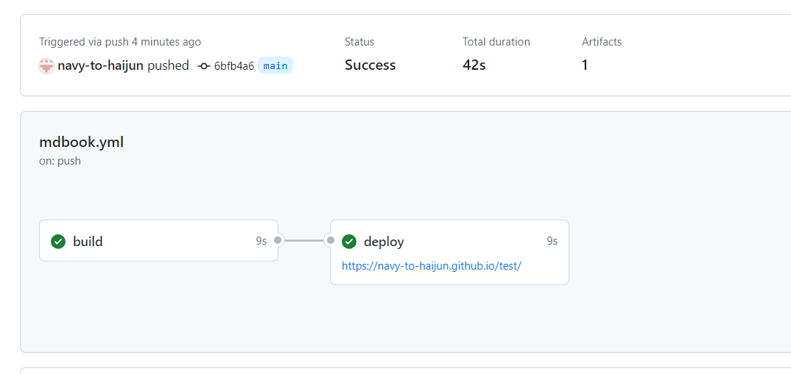

# 基于mdbook和github pages部署个人网站

## 引言

原先一直用微信公众号作为在线笔记，但是markdown到富文本需要一定的转化，另外并不是所有文章都适合发布在微信公众号上（~~发布的科学上网的文章就被微信定义违规被删除~~）。去年参加项目时，发现mentor使用mdbook和 github pages用于记录项目日志。发现此方法非常便于将markdown直接发布成网页。另外， github pages不需要付费，可以做到零成本打造一个知识库。

## [mdbook](https://github.com/rust-lang/mdBook)

mdBook 是一个使用 Markdown 创建书籍的命令行工具。它非常适合创建产品或 API 文档、教程、课程材料或任何需要简洁、易于导航和可自定义演示的内容。

其安装和使用参考[官方教程](https://rust-lang.github.io/mdBook/index.html)

核心命令：

```she
Commands:
  init         Creates the boilerplate structure and files for a new book        
  build        Builds a book from its markdown files
  test         Tests that a book's Rust code samples compile
  clean        Deletes a built book
  completions  Generate shell completions for your shell to stdout
  watch        Watches a book's files and rebuilds it on changes
  serve        Serves a book at http://localhost:3000, and rebuilds it on changes
  help         Print this message or the help of the given subcommand(s)

Options:
  -h, --help     Print help information
  -V, --version  Print version information
```

## [github pages](https://pages.github.com/)

GitHub Pages 是一项静态站点托管服务，它直接从 GitHub 上的仓库获取 HTML、CSS 和 JavaScript 文件，（可选）通过构建过程运行文件，然后发布网站。

利用`action`的`wolkflows`可以实现在`push`以后自动部署，形成个人网站。

个人用户只有两种 GitHub Pages 网站的类型：一种是 `user`(用户)，一种是`project`(项目)。

`user`类型的网址只能对应唯一的用户，而且仓库的名字必须为 `<username>.github.io`，对应的网址为 `http(s)://<username>.github.io`。

`project`类型的仓库则可以新建很多，只要仓库的名字不为 `<username>.github.io` 即可，对应的网址为 `http(s)://<username>.github.io/<repository>`。

**本次使用`project`，直接建立一个笔记仓库，发布对于网址。**

## 步骤

### 1. 创建github 仓库

* 在github中创建名为`haijun-note`的仓库；
* clone仓库到本地: `git clone git@github.com:navy-to-haijun/haijun-note.git`

### 2. 创建mdbook

```she
# 进入haijun-note文件夹
cd haijun-note
# 初始化mdbook
mdbook init
```

创建完的文件结构如下：

* `book/`：存放将Markdown转化为HTML的相关文件
* `src/` ：存放相关Markdown文件；
* `book.toml`：相关配置文档；
* `.gitignore`：忽视将`book`文件上传到github；

注意事项：

使用`mdbook init`时会提示我们是否创建` .gitignore`文件（一般选择`y`）;二是给book取一个title。

### 3. push到github

```shell
git add ./
git commit -m 'add mdbook files'
git push origin main 
```

### 4 创建worlflows

选择仓库的`Settings->Pages`，将界面中的`build and deployment`中的`deploy from a branch`修改为`Github Actions`






github根据文件结构自动推荐了mdbook的workflos的脚本，点击`Configure`, 显示了脚本文档。其中`jobs`字段为mdbook安装和网页部署脚本。可以不修改任何一段代码实现部署。由于mdbook的在线安装需要首先编译rust相关库，导致部署较慢，因此直接使用二进制文件安装，加快部署：

在37行:

```yaml
 run: |
          curl --proto '=https' --tlsv1.2 https://sh.rustup.rs -sSf -y | sh
          rustup update
          cargo install --version ${MDBOOK_VERSION} mdbook
```

修改为：

```yaml
run: |
          mkdir mdbook
          curl -sSL https://github.com/rust-lang/mdBook/releases/download/v0.4.31/mdbook-v0.4.31-x86_64-unknown-linux-gnu.tar.gz | tar -xz --directory=./mdbook
          echo `pwd`/mdbook >> $GITHUB_PATH
```



点击`commit changes`进行提交，push到github上

push后github会增加一个`.github/workflows`文件，里面的`mdbook.yml`为自动部署脚本；

在`Actions`中可以看见部署进程：



通过链接可以访问。

### 5 pull 到本地同步

```shell
git pull origin main
```

以后只要向github`push`，则会自动更新仓库网址的内容，实现自动部署。

## 成果

[仓库](https://github.com/navy-to-haijun/haijun-note)

[个人网站](https://navy-to-haijun.github.io/haijun-note/)

## 总结

1. 由于github中有mdbook的部署脚本，可以实现编写任何脚本，实现网站部署，简单方便；
2. 由于mdbook是针对于电子书的，作为个人博客在感官上差一点，作为一个在线笔记还是可以；
3. mdbook对公式不太友好，无法使用`$`进行公式编辑；
4. mdbook中的搜索功能无法实现对中文搜索；
5. mdbook中的`.md`命令不能有空格；


