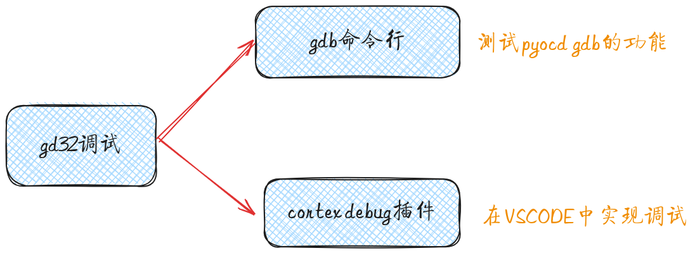
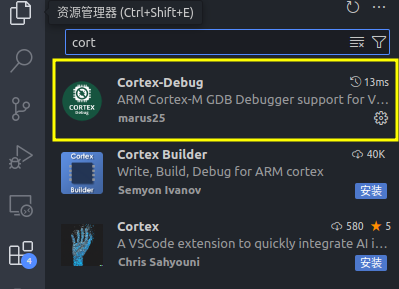
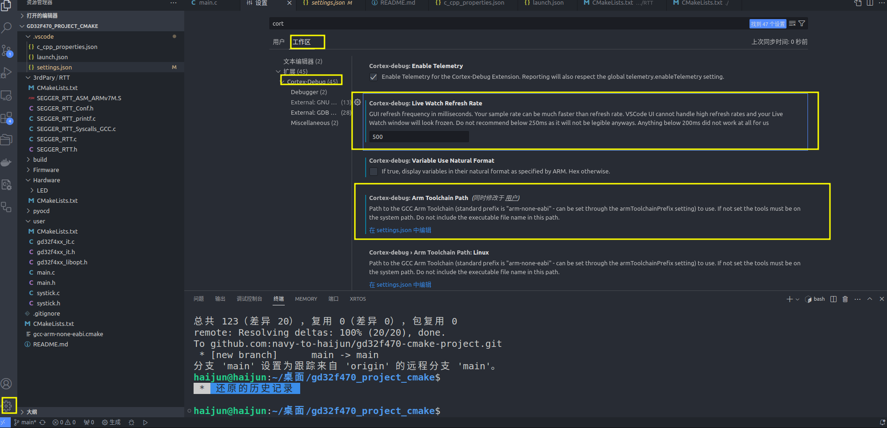
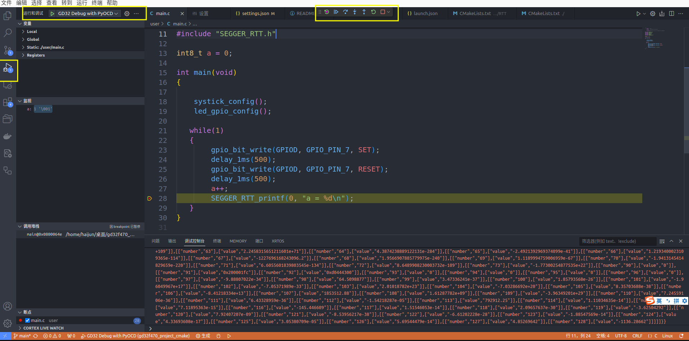

# 基于pyocd 调试gd32f470


[toc]



前面实现了，编译和下载，再实现调试功能就能在linux下开发gd32了。调试的话还是的利用pyocd。

> 本次操作均为基础操作，没有做深入了解

## gdb命令行调试

### 1. 开启gdb服务器 

```shell
pyocd gdb
```

终端输出结果

```shell
0000418 W Board ID lckf is not recognized [mbed_board]
0000445 I Target type is gd32f470zg [board]
0000703 I DP IDR = 0x2ba01477 (v1 rev2) [dap]
0000724 I AHB-AP#0 IDR = 0x24770011 (AHB-AP var1 rev2) [discovery]
0000733 I AHB-AP#0 Class 0x1 ROM table #0 @ 0xe00ff000 (designer=751 part=357) [rom_table]
0000738 I [0]<e000e000:SCS v7-M class=14 designer=43b:Arm part=00c> [rom_table]
0000742 I [1]<e0001000:DWT v7-M class=14 designer=43b:Arm part=002> [rom_table]
0000745 I [2]<e0002000:FPB v7-M class=14 designer=43b:Arm part=003> [rom_table]
0000748 I [3]<e0000000:ITM v7-M class=14 designer=43b:Arm part=001> [rom_table]
0000754 I [4]<e0040000:TPIU M4 class=9 designer=43b:Arm part=9a1 devtype=11 archid=0000 devid=ca1:0:0> [rom_table]
0000758 W Invalid coresight component, cidr=0x0 [rom_table]
0000758 I [5]e0041000: cidr=0, pidr=0, component invalid> [rom_table]
0000768 I CPU core #0: Cortex-M4 r0p1, v7.0-M architecture [cortex_m]
0000768 I   Extensions: [DSP, FPU, FPU_V4, MPU] [cortex_m]
0000768 I   FPU present: FPv4-SP-D16-M [cortex_m]
0000771 I Setting core #0 (Cortex-M4) default reset sequence to ResetSystem [pack_target]
0000776 I 4 hardware watchpoints [dwt]
0000780 I 6 hardware breakpoints, 4 literal comparators [fpb]
0000802 I Semihost server started on port 4444 (core 0) [server]
0000918 I GDB server started on port 3333 (core 0) [gdbserver]

```

从终端可以看出GDB server的端口为3333.

### 2. 利用arm-none-eabi-gdb连接到GDB server

1. 为了方便在终端上操作，将交叉编译链添加到`bashrc`

```shell
export PATH=$PATH:/home/haijun/software/gcc-arm-none-eabi/gcc-arm-none-eabi-10-2020-q4-major/bin
```

可以通过在终端运行`arm-none-eabi-gdb -version`查看是否添加成功。

> 第一次运行可能报错
>
> ```shell
> arm-none-eabi-gdb: error while loading shared libraries: libncurses.so.5: cannot open shared object file: No such file or directory
> ```
>
> 缺少库:
>
> ```shell
> sudo apt install libncurses
> ```

2. 在终端上运行`arm-none-eabi-gdb build/gd32f470BaseProject.elf`开启gdb，开启成功终端会出现`(gdb)`
3. 输入`target remote localhost:3333`连接到服务器

gdb处的终端显示：

```shell
Remote debugging using localhost:3333
0x08000740 in delay_1ms (count=500) at /home/haijun/桌面/gd32f470_project_cmake/user/systick.c:68
68	    while(0U != delay) {
(gdb)
```

pyocd GDB serverd端显示：

```shell
0658343 I Client connected to port 3333! [gdbserver]
0658536 I Attempting to load RTOS plugins [gdbserver]
```

该两处显示gdb连接成功。下面就可以开始调试了

- 在main函数处添加断点：`b main`

```shell
(gdb) b main
Breakpoint 1 at 0x8000610: file /home/haijun/桌面/gd32f470_project_cmake/user/main.c, line 18.
Note: automatically using hardware breakpoints for read-only addresses.

```

- 运行`c`

```shell
(gdb) c
Continuing.
```

其他的命令就不探索了，毕竟没有打算使用命令行调试。只是验证pyocd是可以调试的。

## 在vsode中调试

在vsode中借助`cortex debug`插件进行调试

### 1. 插件安装




### 2. 插件配置

- 设置刷新率；
- 设置交叉编译路径；



以上设置会在`setting.json`看到

```json
{
    "cortex-debug.liveWatchRefreshRate": 500,
    "cortex-debug.armToolchainPath": "/home/haijun/software/gcc-arm-none-eabi/gcc-arm-none-eabi-10-2020-q4-major/bin",
    "cortex-debug.variableUseNaturalFormat": false
}
```

### 3. 调试配置

调试的配置在`launch.json`中

```json
{
    // 使用 IntelliSense 了解相关属性。 
    // 悬停以查看现有属性的描述。
    // 欲了解更多信息，请访问: https://go.microsoft.com/fwlink/?linkid=830387
    "version": "0.2.0",
    "configurations": [
        {
            "name": "GD32 Debug with PyOCD",
            "cwd": "${workspaceRoot}",
            "executable": "./build/gd32f470BaseProject.elf",
            "request": "launch",
            "type": "cortex-debug",
            "runToEntryPoint": "main",
            "servertype": "pyocd",
            "targetId":"gd32f470zg",
            "showDevDebugOutput": "both",
            "cmsisPack": "./pyocd/GigaDevice.GD32F4xx_DFP.3.2.0.pack"
        }
    ]
}
```

- `cwd`：指定命令运行的路径，工程根目录；
- `executable`：指定可执行文件路径
- `runToEntryPoint`：指定从main函数开始调试
- `servertype`：指定使用pyocd作为服务器
- `targetId`：指定芯片类型
- `cmsisPack`：指定pack包；

后面几个配置是pyocd特有的。

### 4. 启动调试



在vsode中的调试没有IAR那么舒服，但是能用。

在linux下对gd32的配置就算完事了，后面就可以开启编程。目前想用gd32通过屏幕实现手写体的识别，凭借它240MHz的主频，估计能效果还行吧。
