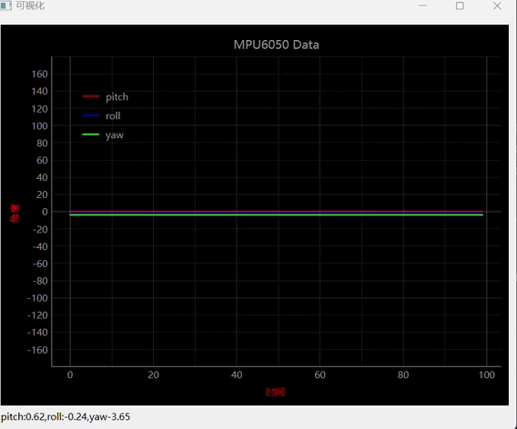

# 基于pyQtGraph实现MPU6050实时曲线绘制

[toc]

前段时间介绍了PC和MCU之间的浮点数传输，单纯的在PC上看数据是枯燥的，自然要实现数据的可视化展现。因此，今天想实现的MPU6050的数据的实时显示。

其实现的效果如图所示：



关于MCU侧的的具体处理，详看后面提供的代码链接或者前面的推文。大致就是MCU通过UDP发出MPU6050的姿态数据。

## GUI工具选择

本次的工具选择仅限于使用python语言。

在PC上做数据的实时展示，最常见的两种工具：

* matplotlib；
* QT；

matplotlib擅长静态数据展示，QT对于动态数据优势更大。由于我是QT小白，自然无法从头开始学习。因此将目光锁定为PyQtGraph。

PyQtGraph 是基于 PyQt / PySide 和 numpy 构建的纯 Python 图形和 GUI 库，与Qt图形界面框架完美融合。通过demo展示，完全被它所吸引住了：


## pyQtGraph

pyQtGraph的官网对其有比较详细的介绍，在我看来，它就是在QT的基础上进一步封装，使其可以加快对动态数据的处理。达到比较好的实时动态。

其安装：

```bash
pip install pyqtgraph -i https://pypi.mirrors.ustc.edu.cn/simple/
```

> 注意：pyqtgraph的依赖为：
>
> * Python 3.7+
> * A Qt library such as PyQt5, PyQt6，PySide2 or PySide5
> * numpy
>
> 因此安装前检查是否有pyqt或者PySide

一旦安装完毕，可以使用它提供的demo。一是检查安装是否正确，二是体验PyQtGraph 能实现的具体功能。进一步评估它是否可以满足自我需求。

```python
import pyqtgraph.examples
pyqtgraph.examples.run()
```

打开的example的源码可以在以下链接查找：

```bash
https://github.com/pyqtgraph/pyqtgraph/tree/master/pyqtgraph/examples
```

## 线程

Qt应用程序基于事件（用户交互、信号和定时器）运行。发生的任何事件会进入事件队列中，然后按照顺序执行。执行事件循环的代码为:

```c
app = QApplication([])
window = MainWindow()
app.exec()
```

默认情况下，触发任何事件的执行程序和都在GUI线程中，导致执行程序运行和GUI的交互不能同时进行。

对于简单的事件，因为能快速完成，控制权很快返回给 GUI 循环，则用户将察觉不到卡顿。但是如果执行长时间运行的任务，例如打开/写入大文件、下载一些数据或渲染一些复杂的图像，就会出现问题界面卡顿的问题。

对于实时数据展示，GUI需要实现两个功能:

* 实时检测是否有新数据；
* 实时根据新数据刷新画面；

如果只使用一个GUI线程，很容易造成画面卡顿，因此需要给数据接收安排一个线程，保证实时性。

qt 提供两种类来实现多线程运行`QRunnable`，`QThreadPool`

* `QThreadPool`：是一个线程池类，管理一组工作线程。

一般使用`QThreadPool`的`setMaxThreadCount()`设置最大线程数；

* `QRunnable`：一个基类，用于实现可以在后台运行的任务。

一般需要重写`run()`定义具体的任务逻辑；

## 实现细节

### 基于pyQtGraph布局

```python
from PyQt6.QtCore import QThreadPool, QRunnable, QTimer
from PyQt6.QtWidgets import QMainWindow, QApplication,QLabel, QVBoxLayout, QWidget, QHBoxLayout
import pyqtgraph as pg
import sys 
import os
from random import randint
import numpy as np

import socket
import struct
import queue

class MainWindow(QMainWindow):

    def __init__(self, *args, **kwargs):
        super(MainWindow, self).__init__(*args, **kwargs)
        # 设置窗口标题
        self.setWindowTitle("可视化")
        # 设置窗口的最小尺寸
        self.setMinimumSize(600, 400)
        self.win = pg.GraphicsLayoutWidget()
        # 抗锯齿
        pg.setConfigOptions(antialias=True)
        # 添加plot
        self.p1 = self.win.addPlot(title = "MPU6050 Data")
        # 使能网格
        self.p1.showGrid(x=True, y=True)
        # 固定尺度
        self.p1.setYRange(-180, 180, padding=0)
        # 图例
        self.p1.addLegend()
        # 添加坐标轴说明
        self.p1.setLabel('left', "<span style=\"color:red;font-size:12px\">角度 </span>")
        self.p1.setLabel('bottom', "<span style=\"color:red;font-size:12px\">时间 </span>")
        # 设置曲线样式
        self.pen1 = pg.mkPen(color='r', width = 2)
        self.pen2 = pg.mkPen(color='b', width = 2)
        self.pen3 = pg.mkPen(color='g', width = 2)
        # 绘制曲线，返回句柄
        self.curve1 = self.p1.plot(pen = self.pen1, name = "pitch")
        self.curve2 = self.p1.plot(pen = self.pen2, name = "roll")
        self.curve3 = self.p1.plot(pen = self.pen3, name = "yaw")
        
        # self.curve1.addLegend()
        # 固定数据长度
        self.data = np.empty((200, 3))
        # 其他组件
        self.lable1 = QLabel("12")
        #布局
        layout1 = QVBoxLayout()

        layout1.addWidget(self.win)
        layout1.addWidget(self.lable1)

        widget = QWidget()
        widget.setLayout(layout1)
        self.setCentralWidget(widget)

        # UDP线程和qt间的数据传输使用队列
        self.data_queue = queue.Queue(maxsize=100)
        # 创建线程池
        self.threadpool = QThreadPool()
        print(f'最大线程数：{self.threadpool.maxThreadCount()}')
        # 启动udp线程
        udp = udp_thread(self.data_queue)
        self.threadpool.start(udp)
        self.data_queue.put
        
        # 启动 定时器
        self.timer = QTimer()
        self.timer.setInterval(50)
        self.timer.timeout.connect(self.updataPlot)
        self.timer.start()
    
```

通过教程QT的`MainWindow`实现以下功能：

1. 添加一个`plot`并设置它的图例，坐标轴说明，曲线样式。返回曲线句柄，方便以后用来更新数据；
2. 添加`QLabel`y用来展示MPU6050的实时值；
3. 创建一个队列`data_queue`，以便GUI线程和数据接收（UPD线程）收线程中的数据传输；
4. 通过`threadpool`启动数据接收线程；
5. 启动一个50ms定时器，在每次超时时，更新曲线。

### 实现数据接收线程

```python
class udp_thread(QRunnable):
    '''
    工作线程，接受回调函数
    '''
    def __init__(self, q:queue.Queue):
        super(udp_thread, self).__init__()

        # IP
        self.udp_addr = ('192.168.7.10', 8888)
        # 设置UDP通信
        self.udp_socket = socket.socket(socket.AF_INET, socket.SOCK_DGRAM)
        # 绑定 IP
        self.udp_socket.bind(self.udp_addr)
        # 设置超时时间
        self.udp_socket.settimeout(0.5)
        # 原始数据
        self.rawbuff = []
        # 队列
        self.q  = q
    
    def run(self):
        '''
        实现run
        '''
        while True:
            try:
                self.rawbuff, addr = self.udp_socket.recvfrom(1024)
                # print(f'[From {addr[0]}:{ addr[1]}]:resive {len(self.rawbuff)} bytes')
                # 解析数据
                self.parseData()

            except socket.timeout:
                print("UDP timeout")
    
    def parseData(self):
        '''
        解析接收到的数据
        '''
         # 判断数据是否为12个
        if len(self.rawbuff) == 12:
            # 解析格式：小端，三个float
            data = struct.unpack('<fff', self.rawbuff) 
            # 存储到队列中
            self.q.put(data)

```

`udp_thread`继承`QRunnable`实现以下功能：

1. 使用`socket`实现PC和MCU的UDP通信。UDP通信设置超时时间，方便提醒没有数据的情况。
2. 重写`run()`方法：实现一旦有缓冲数据则解析数据，再规定时间没有接收到数据，则打印`UDP timeout`;
3. 通过`parseData()`方法实现对流数据的解析。其解析主要使用`struct`类，其详细信息请查看**上一篇推文**；

### 实现实时曲线更新

```python
def updataPlot(self):
        '''
        更新plot
        '''
        while not self.data_queue.empty():
            data = self.data_queue.get()
            self.lable1.setText(f'pitch:{data[0]:.2f},roll:{data[1]:.2f},yaw{data[2]:.2f}')
            #数据左移动1位
            self.data[:-1, :] = self.data[1:, :]
            # 更新最后一位的数据
            self.data[-1, 0] = data[0]
            self.data[-1, 1] = data[1]
            self.data[-1, 2] = data[2]

            self.curve1.setData(self.data[:,0])
            self.curve2.setData(self.data[:,1])
            self.curve3.setData(self.data[:,2])

```

`updataPlot()`会在`timer`出现超时信号被执行。主要实现的功能：

1. 判断`data_queue`队列中是否有数据，有则准备更新曲线，没有则结束，等待下一个超时信号后再判断；
2. 更新曲线：界面一共能显示100个数据，有新数据到来，则左移原数据，将新数据加在后面；

> 该数据更新方法限制界面只能显示固定数据量，无法查看历史数据。pyQtGraph的demo中提供另一种通过叠加曲线句柄的方式来更新数据：规定最大的曲线句柄数，每个句柄显示一小部分数据，当达到最大句柄则将句柄左移，空出来的曲线句柄再显示新数据。这样做的好处，当缩小图像，可以看到部分历史数据。

## 处理数据线程无法关闭问题

在本次实现中，出现关闭GUI界面，但是UDP线程无法关闭的问题。主要原因是UDP线程不是GUI线程的守护线程。因此一旦UDP线程在工作时关闭GUI线程，它不会跟着一起关闭。可以通过重写`closeEvent`方法，一旦出现关闭信号，直接关闭所有线程：
```python
  def closeEvent(self, event):
        '''
        重构closeEvent, 关闭敞窗口时，退出所有线程
        '''
        os._exit(0)
```

## 结束

利用空闲时间，利用mp6050和esp32s3实现MPU6050的原始数据读取，基于MDP实现其姿态解算；然后觉得MPU6050的姿态数据应该传到PC上，方便分析和可视化，实现PC和MCU间的浮点数传输，进一步使用传递的浮点数在pyQtGraph的加持下实现实时显示。

接下来，将选择以下ESP32实现嵌入式AI、FPGA或者无刷直流电机三个方向之一进行学习。

详细代码查看`https://github.com/navy-to-haijun/gesture-recognition-mpu6050/tree/floatdev`

